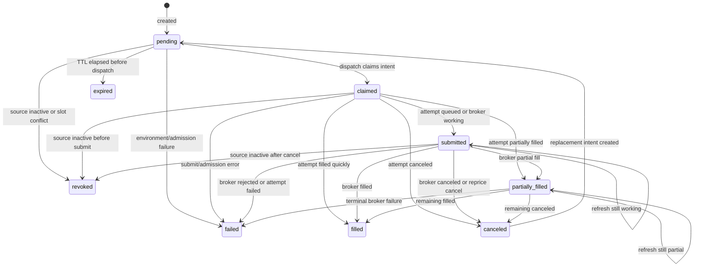
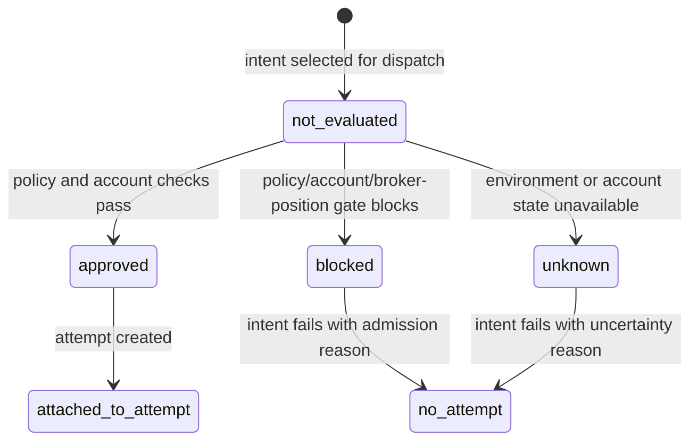
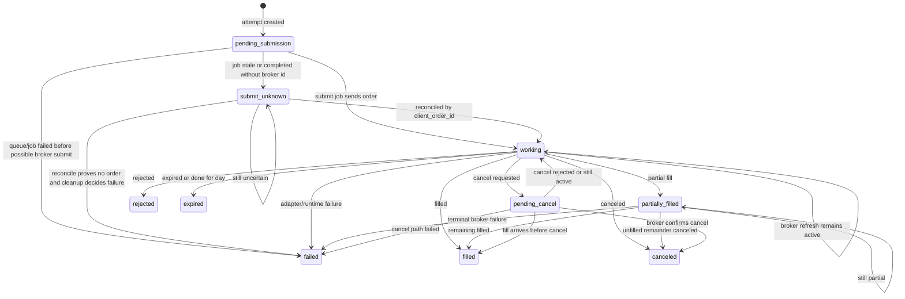
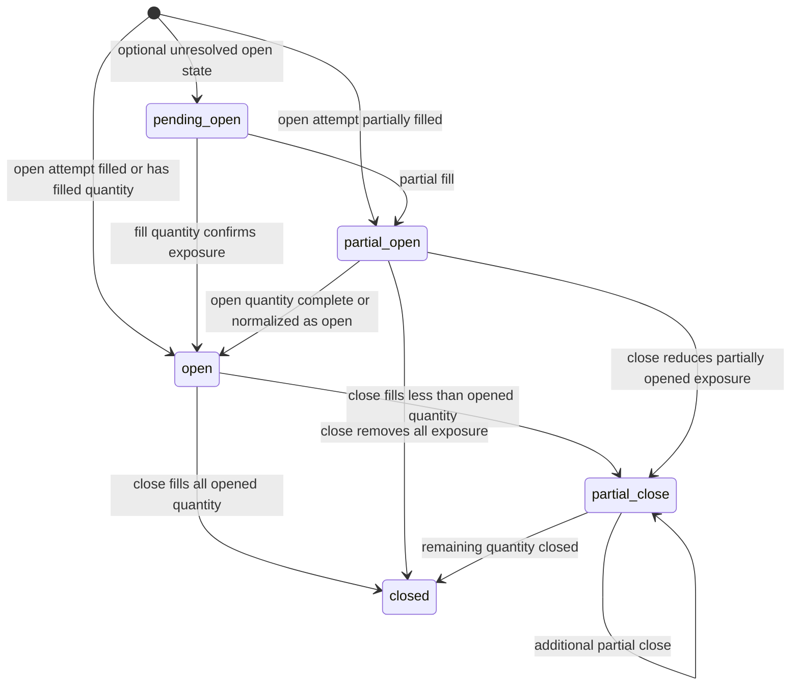
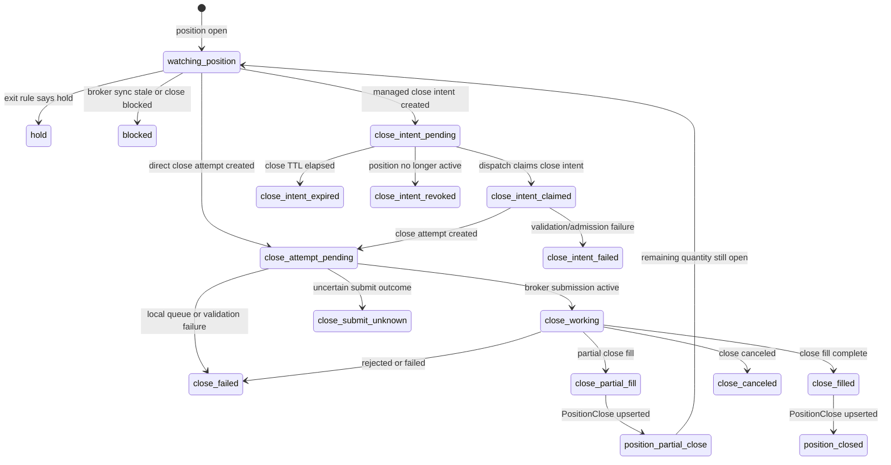

# Trading Lifecycle State Machines

Date: 2026-06-03

Status: planning reference for refactor/design work. This is not the canonical current-state architecture document.

Related:

- [System Architecture](../current_system_state.md)
- [Nautilus Patterns Inside Spreads](./2026-06-03_nautilus_patterns_inside_spreads_architecture.md)
- [Spreads Architecture Review](./2026-06-03_spreads_architecture_review.md)

## Purpose

This document captures the trading lifecycle state machines that need to be understood before heavy refactoring. It is intentionally object and invariant focused.

The current object names are useful context, not sacred compatibility requirements. A future rewrite can rename, reshape, or replace tables and services where that produces a cleaner design. What should survive is the semantic clarity:

- decisions are separate from dispatch requests
- risk/admission decisions are separate from broker submission attempts
- dispatch requests are separate from broker submission attempts
- broker orders and fills are facts under attempts
- positions are projections from filled attempts and closes
- unknown broker submission outcomes are first-class states
- close behavior is a lifecycle, not an afterthought

## Lifecycle Overview

Current flow:

```text
SignalState
  |
  v
Opportunity
  |
  v
OpportunityDecision
  |
  v
ExecutionIntent
  |
  v
RiskDecision / Admission
  |
  v
ExecutionAttempt
  |
  +-- ExecutionOrder
  +-- ExecutionFill
  |
  v
PortfolioPosition
  |
  v
PositionClose
```

Target-design stance:

```text
Signal -> Decision -> Intent -> Admission -> Attempt -> Broker Facts -> Position -> Close
```

The shorter target line is the important one. The current schema is just today's implementation of it.

## ExecutionIntent

An `ExecutionIntent` is the durable dispatch request. It is not a broker order. It says that an evaluated decision or managed position wants an action.

Current sources:

- entry automation decision creates open intents
- Finviz direct trading creates direct equity/option open intents
- exit manager creates close intents
- repricing creates replacement intents

Current active states:

- `pending`
- `claimed`
- `submitted`
- `partially_filled`

Current terminal states:

- `filled`
- `failed`
- `canceled`
- `revoked`
- `expired`

Current state machine:



Important current mechanics:

- `pending` intents have TTLs and can expire before dispatch.
- Dispatch claims an intent before creating/submitting an attempt.
- Claiming writes an intent event with the claim token.
- The target must still be active at dispatch time:
  - open intent target: opportunity is active and live
  - close intent target: position exists and is open/partial
- Slot cleanup revokes stale duplicate pending/claimed intents.
- Repricing does not mutate the old intent into a new price. It cancels/supersedes the old intent and creates a replacement intent.
- An intent's state is synchronized from the linked attempt status after submission and refresh.

Target rewrite notes:

- Keep `Intent` as a real command object.
- Make the state enum explicit and typed.
- Treat replacement lineage as first-class: `supersedes_intent_id`, `superseded_by_intent_id`, and reason.
- Do not let direct feed paths bypass decision/intent audit.
- Do not couple intent state names to broker status names. Map broker status through attempt lifecycle.

## Admission And RiskDecision

Admission is the pre-attempt gate. It decides whether a requested open or close action is allowed to become a broker submission attempt.

Current open-execution risk outcomes:

- `approved`
- `blocked`
- `unknown`

Current state machine:



Current open-admission inputs include:

- risk policy
- execution/deployment policy
- session open positions
- pending/open attempts
- existing broker-held position conflicts
- candidate quote age
- candidate notional and max loss
- contract caps
- position and session notional caps
- buying power estimate
- kill switch and environment gates

Current mechanics:

- Open opportunity execution records a `RiskDecision` before attempt creation.
- Approved risk decisions are attached to the created execution attempt.
- Blocked or unknown risk decisions fail admission before an attempt exists.
- Direct single-leg paths currently have validation and lane caps, but they do not all use the same `RiskDecision` lifecycle.
- Close admission currently lives in close validation and exit-manager guards rather than in a unified risk/admission object.

Target rewrite notes:

- Make admission first-class for every live entry path, including Finviz long calls.
- Keep `blocked` and `unknown` distinct. Unknown should not be treated as approved or as a generic failure.
- Separate strategy decision reasons from admission block reasons.
- Consider separate but related `OpenAdmission` and `CloseAdmission` objects if close policy remains materially different from entry risk.
- Persist policy snapshot, metrics, blockers, and evidence for every admission decision that can affect broker submission.

## ExecutionAttempt

An `ExecutionAttempt` is the broker submission attempt. It is where order payloads, canonical legs, policy snapshots, risk decisions, source job, client order id, broker order id, errors, orders, and fills belong.

Current local statuses:

- `pending_submission`
- `submit_unknown`

Current broker-working statuses:

- `accepted`
- `accepted_for_bidding`
- `calculated`
- `held`
- `new`
- `partially_filled`
- `pending_cancel`
- `pending_new`
- `pending_replace`
- `replaced`
- `stopped`
- `suspended`

Current terminal statuses:

- `canceled`
- `done_for_day`
- `expired`
- `failed`
- `filled`
- `rejected`

Current state machine:



Current lifecycle classifier phases:

- `queued_local`
- `submit_unknown`
- `canceling`
- `partial_open`
- `working_fresh`
- `working_stale`
- `terminal`

Important current mechanics:

- An attempt starts as `pending_submission`.
- The submit job owns the transition from local pending to broker-submitted or failed.
- `submit_unknown` exists because worker/job state can be stale after a possible broker submit.
- Broker reconciliation should use `client_order_id` before declaring failure.
- Working attempts can block capacity and position slots even before a position exists.
- Orders and fills are projections under the attempt, not replacements for the attempt.
- Attempt refresh syncs linked intent state.
- Filled open attempts feed position projection.
- Filled close attempts feed close projection.

Target rewrite notes:

- Preserve `submit_unknown` as a first-class state. Hiding uncertainty creates dangerous cleanup.
- Separate local queue state, adapter submission state, broker order state, and position impact.
- Keep attempt facts immutable enough that operator history survives repricing/retries.
- Make stale handling explicit instead of scattered across worker cleanup paths.

## PortfolioPosition

A `PortfolioPosition` is the session-owned position projection. It is created from a filled open attempt, then recalculated from close records and broker reconciliation.

Current statuses:

- `pending_open`
- `partial_open`
- `open`
- `partial_close`
- `closed`

Current state machine:



Important current mechanics:

- No position is created when filled quantity is zero.
- Position creation links back to the opening attempt.
- Position creation also links the opening intent when possible.
- Remaining quantity is recalculated from all `PositionClose` rows.
- Realized PnL is recalculated from close rows.
- `session_positions` owns day/session attribution.
- Broker-sync may update reconciliation fields and status evidence, but it should not become the strategy decision layer.

Target rewrite notes:

- Treat position state as a projection from events/facts, not as the primary source of broker truth.
- Separate position lifecycle from order lifecycle. A working order is not the same thing as a position.
- Make partial open and partial close semantics explicit. If the future model does not want `partial_open`, remove it deliberately instead of leaving it as dead vocabulary.
- Keep session attribution explicit even if tables are redesigned.

## Close Lifecycle

The close lifecycle currently spans multiple objects:

- `PortfolioPosition`
- close decision from exit/management rules
- close `ExecutionIntent`
- close `ExecutionAttempt`
- `PositionClose`
- recalculated `PortfolioPosition`

Current state machine:



Current close guards:

- exit manager skips when broker sync is not current
- close manager skips when an active close intent already exists
- close manager skips when an active close attempt already exists
- `submit_position_close_by_id` refuses to create another active close attempt for the same position
- close validation requires a closeable position, quantity, and positive limit/close mark

Target rewrite notes:

- Make close lifecycle first-class in the design, not just `trade_intent=close`.
- Keep one-active-close-per-position as a semantic rule unless deliberately replaced by a more expressive close-order policy.
- Represent close reason, quote source, limit source, reprice count, and policy snapshot as structured facts.
- Reuse attempt lifecycle for broker submission, but keep close decision lifecycle separate from broker order lifecycle.

## Cross-Object Invariants

These are the important invariants to carry into any rewrite:

- A decision can exist without an intent.
- An intent can exist without an attempt.
- An admission decision can block or fail before an attempt exists.
- An attempt can exist without a broker order when it is still local or failed before submission.
- An attempt can be `submit_unknown`; this must trigger reconciliation, not blind failure.
- Orders and fills belong under attempts.
- Positions are projections from filled open attempts and close records.
- Close records are tied to close attempts.
- Repricing creates lineage instead of overwriting history.
- Direct feed flows should not bypass audit if they become part of the trading system.
- Runtime provenance matters more than enforcing one process as broker owner.

## Proper Rewrite Direction

The cleaner future model should be designed as if we are free to fix the current shape:

- Use typed state enums instead of repeated string sets.
- Make lifecycle transitions explicit functions with reason payloads.
- Make admission/risk decisions first-class for all live entry paths.
- Make direct feed, canonical automation, and close management use the same decision/intent/attempt language.
- Consider making `CloseDecision` and `CloseIntent` first-class objects if close behavior keeps growing.
- Keep attempts, orders, fills, and closes as durable facts.
- Treat positions and operator dashboards as projections.
- Keep broker reconciliation as a core lifecycle, not an operational afterthought.
- Do not preserve current table names, function names, or service layout just for compatibility.

## Source Files

- [execution_intents/shared.py](../../packages/core/services/execution_intents/shared.py)
- [execution_intents/__init__.py](../../packages/core/services/execution_intents/__init__.py)
- [execution_intents/repricing.py](../../packages/core/services/execution_intents/repricing.py)
- [execution_intents/maintenance.py](../../packages/core/services/execution_intents/maintenance.py)
- [execution_lifecycle.py](../../packages/core/services/execution_lifecycle.py)
- [execution/__init__.py](../../packages/core/services/execution/__init__.py)
- [session_positions.py](../../packages/core/services/session_positions.py)
- [exit_manager.py](../../packages/core/services/exit_manager.py)
- [execution_models.py](../../packages/core/storage/execution_models.py)
