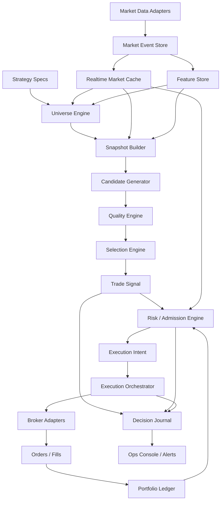
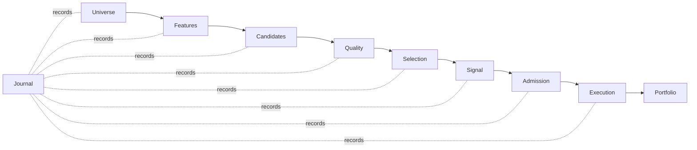

# Entry Selection Engine End Goal Architecture

Date: 2026-06-08

Status: clean-sheet target architecture. This document describes the desired end state, not the current runtime implementation.

Related:

- [Current System State](../current_system_state.md)
- [Trading Engine Inspiration Repos](./2026-06-08_trading_engine_inspiration_repos.md)
- [Entry Quality Pipeline Refactor Plan](./2026-06-08_entry_quality_pipeline_refactor.md)
- [Strategy Sourcing, Candidate Scanning, And Capture Architecture](./2026-06-03_strategy_sourcing_scanning_capture_architecture.md)
- [Target Trading Lifecycle Object Model](./2026-06-03_target_trading_lifecycle_object_model.md)

## Recommendation

Build the options entry path as a deterministic strategy decision engine, not as an "options picker".

Options selection is one stage inside a larger trading decision pipeline:

1. market data is normalized,
2. strategy facts are derived,
3. candidates are generated,
4. quality is evaluated,
5. the best trade idea is selected,
6. account and portfolio admission decide whether it may be traded,
7. execution owns broker lifecycle.

The most important architectural line is:

> Selection produces the best trade idea. Admission decides whether this account may take it. Execution decides how to place it.

## End Goal Diagram



The compact lifecycle is:



## Core Boundary

The selector must be account-agnostic.

It answers:

> Given this strategy, market state, and option chain, what is the best trade candidate?

It must not answer:

- Can this account afford it?
- Are we already full?
- Should we submit now?
- Which broker route should we use?

Those belong to admission and execution.

## Components

### Strategy Specs

Strategy specs are declarative configs, not scattered code branches.

A strategy spec defines:

- universe source,
- entry schedule,
- trade structure, such as `long_call`, `put_credit_spread`, or `long_straddle`,
- required market features,
- candidate construction rules,
- quality profile,
- ranking policy,
- signal emission policy,
- rollout mode: `backtest`, `shadow`, `paper`, or `live`.

The strategy owns intent. The engine owns mechanics.

### Market Data Layer

All vendor APIs feed normalized data into one market model.

Inputs include:

- equity quotes and bars,
- option chains,
- option snapshots,
- greeks,
- corporate actions,
- earnings and calendar data,
- volatility data,
- optional fundamentals, news, or research.

Outputs include:

- `MarketSnapshot`,
- `UnderlyingSnapshot`,
- `OptionChainSnapshot`,
- `OptionContractSnapshot`.

No strategy should call a vendor API directly.

### Feature Store And Snapshot Builder

The snapshot layer converts raw market data into strategy-ready facts.

Examples:

- momentum state,
- liquidity state,
- spread quality,
- volume expansion,
- ATR or range context,
- IV rank or percentile,
- earnings proximity,
- trend regime,
- optionability,
- chain completeness.

The selector reads facts. It does not fetch data.

### Universe Engine

The universe engine produces the symbols worth evaluating.

It should support:

- static watchlists,
- scanner output,
- scheduled universe refreshes,
- liquidity filters,
- earnings or event filters,
- strategy-specific inclusion and exclusion rules.

Contract:

```text
UniverseRun
- strategy_id
- symbols[]
- source
- freshness
- rejected_symbols[]
- diagnostics
```

### Candidate Generator

The candidate generator turns a symbol snapshot into option trade candidates.

For a long call, it may generate contracts by:

- DTE window,
- delta window,
- liquidity requirements,
- bid/ask constraints,
- open interest,
- intrinsic/extrinsic profile,
- return-on-risk profile.

For spreads, it generates structures, not individual legs.

Contract:

```text
OptionCandidate
- strategy_id
- symbol
- structure_type
- legs[]
- quote_snapshot
- greeks
- estimated_entry_price
- max_risk
- max_reward
- liquidity_metrics
- candidate_features
```

### Quality Engine

The quality engine is the center of the entry path.

It produces a waterfall, not just a score:

```text
QualityWaterfall
- source_preflight
- underlying_setup
- chain_viability
- contract_fit
- liquidity_quality
- premium_quality
- strategy_edge
- final_candidate_quality
```

Each stage returns:

```text
pass | watch | block
reason_code
human_reason
evidence
thresholds_used
```

Every rejection should be explainable, stable, and replayable.

### Selection Engine

The selection engine takes passing candidates and chooses the best signal.

Responsibilities:

- rank candidates,
- enforce one-signal-per-symbol or one-signal-per-strategy policy,
- apply hysteresis and stability rules,
- avoid noisy flip-flopping,
- emit selected, monitored, and rejected candidates,
- never inspect account buying power.

Contract:

```text
TradeSignal
- strategy_id
- symbol
- candidate_id
- score
- confidence
- selection_state
- reason_codes
- full_waterfall
```

### Risk And Admission Engine

Admission is where account state enters the pipeline.

It checks:

- buying power,
- current positions,
- strategy exposure,
- symbol exposure,
- daily loss limits,
- open orders,
- cooldowns,
- kill switches,
- stale market data,
- live or paper permissions.

Contract:

```text
AdmissionDecision
- admitted | blocked | reduced
- max_quantity
- reason_codes
- account_snapshot
- portfolio_constraints
```

### Execution Orchestrator

The execution orchestrator turns admitted decisions into broker actions.

Responsibilities:

- create execution intent,
- price order,
- submit,
- monitor,
- replace or cancel,
- handle partial fills,
- reconcile broker state,
- emit lifecycle events.

The execution layer owns order mechanics. The selector never thinks in broker API terms.

### Decision Journal

Every run should be replayable.

Store:

- universe run,
- market snapshot IDs,
- features used,
- candidates generated,
- quality waterfall,
- selected signal,
- admission decision,
- execution intent,
- order attempts,
- fills,
- final position state.

The same journal supports backtesting, shadow validation, debugging, and operator trust.

## Data Ownership

| Data | Owner | Notes |
| --- | --- | --- |
| Raw vendor messages | Market Data Layer | Stored as normalized events or retained raw payloads where useful for audit. |
| Market cache | Market Data Layer | Current quotes, bars, chains, snapshots, and greeks. |
| Features | Feature Store / Snapshot Builder | Derived facts with point-in-time provenance. |
| Universe runs | Universe Engine | Symbol set and rejection evidence for one strategy run. |
| Candidates | Candidate Generator | Strategy-shaped trade structures before final selection. |
| Quality waterfall | Quality Engine | Stage-by-stage evidence, thresholds, and reason codes. |
| Trade signals | Selection Engine | Account-agnostic chosen or monitored trade ideas. |
| Admission decisions | Risk / Admission Engine | Account-aware trading permission and quantity limits. |
| Execution intents | Execution Orchestrator | Durable requests to open, close, replace, or cancel. |
| Orders and fills | Execution Orchestrator / Broker Adapter | Broker lifecycle and reconciliation facts. |
| Positions | Portfolio Ledger | Projected and reconciled portfolio state. |

## Runtime Modes

The same engine should support every mode by changing adapters and permissions, not by changing strategy logic.

| Mode | Market Data | Admission | Execution |
| --- | --- | --- | --- |
| Backtest | Historical event store | Simulated portfolio | Simulated fills |
| Shadow | Live market data | Simulated or read-only account snapshot | No broker submit |
| Paper | Live market data | Paper account | Paper broker |
| Live | Live market data | Live account | Live broker |

## Design Rules

- Strategy configs declare what the strategy wants.
- Market adapters normalize data and know vendors.
- Snapshot builders compute facts once.
- Filters evaluate facts and never fetch their own data.
- Candidate generation is strategy-specific but vendor-agnostic.
- Selection is account-agnostic.
- Admission is account-aware.
- Execution is broker-aware.
- Every block has stable reason codes.
- Every accepted or rejected decision can be replayed from the journal.

## Non-Goals

- Do not embed an external trading framework as the core runtime.
- Do not make LLM output a live trading decision source.
- Do not let broker adapters leak into strategy selection.
- Do not put buying-power logic inside candidate quality.
- Do not create separate selector implementations for backtest, shadow, paper, and live.
- Do not treat alerts as source-of-truth state.

## Risks And Mitigations

| Risk | Mitigation |
| --- | --- |
| The selector becomes another monolith. | Keep explicit component contracts and persist boundary artifacts. |
| Strategy configs become arbitrary boolean mazes. | Use named quality profiles and controlled override points. |
| Backtest and live drift apart. | Run both through the same journal-backed selector. |
| Operators cannot explain rejected trades. | Require reason codes, thresholds, and evidence on every waterfall stage. |
| Broker mechanics influence signal quality. | Keep broker concerns behind admission and execution boundaries. |
| Market data gaps masquerade as weak strategy quality. | Model missing, stale, and partial data as first-class quality outcomes. |

## Decisions

1. The end-state engine is built inside Spreads as Python-native domain services.
2. External trading frameworks are inspiration only, not runtime dependencies.
3. The selector is account-agnostic.
4. Admission is the first account-aware boundary.
5. Execution owns broker lifecycle and order mutation.
6. The decision journal is mandatory architecture, not optional logging.
7. Backtest, shadow, paper, and live share the same strategy decision pipeline.
