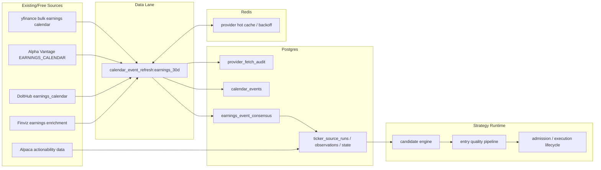

# Earnings Event Source Consensus Cutover

Status: draft v2 for review
Date: 2026-06-15
Related bead: `spr-9v2.2`

## Executive Decision

Build a cached, event-driven earnings source for the active earnings strategies.

The best architecture is:

```text
free provider refresh job
  -> Redis hot provider cache/backoff
  -> Postgres fetch audit
  -> normalized calendar_events
  -> earnings_event_consensus
  -> ticker_source:earnings_event_window
  -> Alpaca actionability filters
  -> existing strategy candidate engine
```

This boundary is not overkill. It is the minimum clean architecture that prevents strategy runtime from depending on live Yahoo/Finviz/Alpha/DoltHub HTTP behavior.

The first implementation should be smaller than the first draft:

- one refresh job, not a new orchestration subsystem
- Redis for hot provider response/backoff cache, Postgres for durable audit and trading facts
- no yfinance per-symbol fanout in V1
- Finviz only for conflicts or already-interesting names
- no `liquid_stocks` fallback for earnings strategies after cutover

## Problem

The four active earnings strategies are real authored paper strategies, but they currently consume the static `liquid_stocks` universe. That makes them build against broad liquid names and then depend on calendar policy to reject most symbols. The source model is backward.

Earnings strategies should start from symbols with upcoming earnings events, then use Alpaca and the existing entry-quality pipeline to decide whether an options trade is actionable.

## Non-Negotiables

- Strategy candidate runtime must not call yfinance, Alpha Vantage, DoltHub, or Finviz.
- `yfinance` is the primary free 30-day discovery source.
- Alpha Vantage, DoltHub, and Finviz stay as corroborating sources.
- Alpaca is not an earnings-date source. It validates tradability, optionability, liquidity, chains, and expected move.
- Consensus is persisted. Provider disagreement must be visible, not hidden.
- Earnings strategies cut from `liquid_stocks_static` to `earnings_event_window_dynamic`.
- Do not keep a static fallback for earnings strategies. Stale or empty earnings data should degrade visibly.

## Explicitly Deferred From V1

- yfinance per-ticker enrichment for every event symbol.
- Moving Alpaca corporate-action refresh out of the existing resolver path.
- A generic provider framework for every future data source.
- Operator UI work.
- Historical evaluator/backtest work.
- Broad Finviz enrichment.

These are useful later, but they are not required to stop the current earnings-source architecture from being wrong.

## Current State

Runtime facts observed on 2026-06-15:

- `yfinance` is not installed and is not used.
- `build_calendar_event_resolver()` wires:
  - DoltHub-backed `EarningsCalendarAdapter`
  - `FinvizEarningsAdapter`
  - optional `AlphaVantageEarningsCalendarAdapter`
  - `AlpacaCorporateActionsAdapter`
  - `MacroCalendarAdapter`
- The generic `EarningsCalendarAdapter` is actually DoltHub-backed and reports source `dolt_earnings_calendar`.
- `dolt_earnings_calendar` is marked required for `single_name_equity` calendar coverage.
- `ALPHA_VANTAGE_API_KEY` is configured in deployed containers.
- `FINVIZ_COOKIE` is not configured in deployed containers.
- `finviz_momentum` is actively used for `momentum_long_calls`; that is separate from Finviz earnings enrichment.
- The active earnings strategies currently use static `liquid_stocks`:
  - `short_dated_earnings_call_debit`
  - `short_dated_earnings_put_debit`
  - `short_dated_earnings_long_straddle`
  - `short_dated_earnings_long_strangle`

## Target V1 Architecture



The V1 implementation has one data-lane job:

1. Read Redis hot cache/backoff state, then Postgres audit as the durable throttle fallback.
2. Fetch yfinance 30-day bulk earnings pages when cache allows.
3. Fetch Alpha Vantage bulk earnings calendar when cache allows.
4. Fetch DoltHub 30-day earnings rows when cache allows.
5. Fetch Finviz only for conflict or selected/ambiguous symbols, capped.
6. Store raw provider responses in Redis with TTL.
7. Write compact provider fetch audit rows to Postgres.
8. Write normalized provider rows to `calendar_events`.
9. Compute `earnings_event_consensus`.
10. Refresh `ticker_source:earnings_event_window` with Alpaca actionability filters.

## Source Roles

| Source | V1 role | Confidence role | Fetch shape |
|---|---|---|---|
| yfinance bulk calendar | Primary discovery | Medium alone, high when corroborated | 30-day paginated pull |
| Alpha Vantage | Structured corroboration | Medium | One no-symbol `EARNINGS_CALENDAR` pull, filter to 30 days |
| DoltHub | Open-data fallback/corroboration | Low | One 30-day SQL query |
| Finviz earnings | Conflict/near-term enrichment only | Low | Capped, sparse fetches |
| Alpaca | Actionability validation | Not earnings truth | Assets, optionability, stock snapshots, option contracts, option chain snapshots, expected move |

Provider ordering is not provider truth. `yfinance` discovers breadth. Consensus decides trust. Alpaca decides whether the symbol can be traded.

## Provider Fetch Policy

### yfinance

Use `yfinance.Calendars(start, end).get_earnings_calendar(...)`.

V1 policy:

- Pull `today` through `today + 30 calendar days`.
- Use `limit=100`.
- Increment `offset` until a page returns fewer than 100 rows.
- Use `filter_most_active=True`.
- Use a configurable `market_cap` cutoff.
- Default proposed cutoff: `1_000_000_000`.
- Cache every page in Redis before normalization.

Do not use broad per-symbol `Ticker.get_earnings_dates()` in V1. Add it later only if bulk discovery leaves real timing/date gaps.

### Alpha Vantage

Use the configured `ALPHA_VANTAGE_API_KEY`.

V1 policy:

- Prefer one no-symbol `EARNINGS_CALENDAR` request.
- Use `horizon=3month`.
- Filter to the 30-day window locally.
- Do not run broad per-symbol Alpha Vantage calls.

### DoltHub

Keep DoltHub, but name it honestly in code as `DoltHubEarningsCalendarAdapter`.

V1 policy:

```sql
select act_symbol, date, `when`
from earnings_calendar
where date >= '<start_date>'
  and date <= '<end_date>'
order by date asc, act_symbol asc
```

DoltHub should not remain individually required once `earnings_event_consensus` exists.

### Finviz

Keep the current low-confidence Finviz earnings adapter, but make it sparse.

V1 policy:

- Do not fetch Finviz for the whole 30-day event universe.
- Fetch only when:
  - sources disagree,
  - timing is missing for a near-term event,
  - or the symbol already passed initial Alpaca actionability.
- Cap fetches per refresh cycle.
- If Finviz returns 403/429, record degraded state and keep going.

### Alpaca

Alpaca does not provide earnings dates. It should be used for:

- active/tradable asset validation
- optionable underlying validation
- stock price and daily volume checks
- target-DTE option contract availability
- option chain snapshots
- expected-move estimates

V1 can leave existing Alpaca corporate-action resolver behavior alone. Moving that into the same data-lane refresh model is a good V2 cleanup, not a blocker for earnings-source cutover.

## Cache And Audit Contract

Use Redis for hot provider protection and Postgres for durable audit.

The reason for the split:

- Redis is the right place for short-lived raw provider responses, TTLs, and backoff flags.
- Postgres is the right place for normalized trading facts and bounded fetch evidence.
- Strategy runtime must not depend on Redis for earnings truth; it should read Postgres facts.
- If Redis is flushed or unavailable, Postgres audit still prevents an immediate provider-call storm.

### Redis Hot Cache

Purpose: prevent repeated provider calls and absorb provider flakiness without bloating Postgres with raw payloads.

Example keys:

```text
spreads:provider:yfinance:earnings_calendar:<params_hash>:offset:<offset>
spreads:provider:alpha_vantage:earnings_calendar:<params_hash>
spreads:provider:dolthub:earnings_calendar:<params_hash>
spreads:provider:finviz:earnings:<symbol>:<params_hash>
spreads:provider:<provider>:<endpoint>:backoff
spreads:calendar:earnings_30d:refresh_lock
```

Use the existing job singleton lease for scheduled refreshes. Use `refresh_lock` only for ad-hoc/operator refresh commands that bypass the scheduler.

Redis values should include:

| Field | Purpose |
|---|---|
| `status` | `ok`, `empty`, `rate_limited`, `failed` |
| `payload` | Raw parsed provider payload for successful responses |
| `payload_hash` | Hash for audit comparison |
| `row_count` | Parsed row count where available |
| `fetched_at` | Actual provider-call time |
| `expires_at` | Earliest normal refetch time |
| `error` | Bounded error detail for failures |

Proposed Redis TTLs:

| Provider data | TTL |
|---|---:|
| yfinance 30-day pages | 6 hours |
| Alpha Vantage bulk | 24 hours |
| DoltHub bulk | 24 hours |
| Finviz sparse enrichment | 6 hours |
| provider backoff | 15-60 minutes depending on failure |
| ad-hoc refresh lock | 10 minutes |

Do not include API keys, cookies, auth headers, or full request headers.

### Postgres Fetch Audit

Add one narrow table: `provider_fetch_audit`.

Purpose: explain refresh behavior and provide a durable throttle fallback. This is not the raw payload cache.

Proposed columns:

| Column | Purpose |
|---|---|
| `audit_id` | Primary key |
| `provider` | `yfinance`, `alpha_vantage`, `dolthub`, `finviz` |
| `endpoint` | Logical endpoint, such as `earnings_calendar` |
| `params_hash` | Hash of normalized params, excluding secrets |
| `params_json` | Optional bounded normalized params, no secrets |
| `coverage_start` | Start of represented window |
| `coverage_end` | End of represented window |
| `page_key` | `offset=0`, `offset=100`, `symbol=AAPL`, etc. |
| `status` | `ok`, `empty`, `rate_limited`, `failed` |
| `cache_hit` | Whether the refresh used Redis instead of calling the provider |
| `payload_hash` | Hash for payload comparison |
| `row_count` | Parsed row count where available |
| `fetched_at` | Actual provider-call time |
| `expires_at` | Earliest normal refetch time |
| `backoff_until` | Earliest retry after provider failure |
| `error_code` | Compact error class or status code |
| `error_message` | Bounded error summary |

Do not store raw provider payloads in Postgres V1. The normalized provider row payload already lives in `calendar_events.payload_json`; raw response replay can wait until there is evidence it is needed.

## Normalized Provider Rows

Keep using `calendar_events` for provider rows.

Provider source names:

- `yfinance_earnings_calendar`
- `alpha_vantage_earnings_calendar`
- `dolt_earnings_calendar`
- `finviz_earnings`

V1 does not need a separate `yfinance_ticker_earnings` source because per-ticker enrichment is deferred.

Stable event ID:

```text
<source>:<symbol>:<event_date>:<session_or_unknown>:<provider_row_hash>
```

The row remains:

- `event_type = earnings`
- `symbol = <ticker>`
- `scheduled_at = normalized best timestamp from provider row`
- `source_confidence = provider-level confidence`
- `payload_json = compact provider row`

## Consensus Contract

Add `earnings_event_consensus`.

Purpose: give ticker sources and strategy diagnostics one clean derived event fact per symbol/date.

Proposed columns:

| Column | Purpose |
|---|---|
| `consensus_id` | `earnings_event:<symbol>:<event_date>` |
| `symbol` | Uppercase ticker |
| `event_date` | Market-local date |
| `scheduled_at` | Best resolved timestamp |
| `session_timing` | `before_open`, `after_close`, `during_market`, `unknown` |
| `event_status` | `scheduled`, `reported`, `projected`, `unknown` |
| `primary_source` | Source chosen as representative |
| `supporting_sources_json` | Sources agreeing with date/timing |
| `conflicting_sources_json` | Sources that materially disagree |
| `consensus_status` | `consensus`, `date_only`, `single_source`, `conflict`, `missing` |
| `source_confidence` | `high`, `medium`, `low`, `unknown` |
| `timing_confidence` | `high`, `medium`, `low`, `unknown` |
| `provider_payload_json` | Compact merged estimates/context |
| `computed_at` | Consensus computation timestamp |
| `stale_after` | When ticker source should stop using the row |

Do not write consensus back into `calendar_events` as a fake source. Provider facts and derived facts stay separate.

## Consensus Rules

Default source confidence:

- `high`: yfinance date agrees with at least one of Alpha Vantage, DoltHub, or Finviz.
- `medium`: yfinance-only, or Alpha Vantage plus DoltHub agree without yfinance.
- `low`: single non-yfinance source.
- `conflict`: sources disagree by more than one calendar day, or same date with incompatible timing and no clear winner.

Default timing confidence:

- `high`: at least two sources agree on BMO/AMC/exact timing.
- `medium`: one source has BMO/AMC/exact timing and the date is corroborated.
- `low`: date exists but timing is unknown or inferred.
- `unknown`: no usable timing.

Session normalization:

- `before_open`: `09:00 America/New_York`
- `after_close`: `16:15 America/New_York`
- `during_market`: provider timestamp if available, otherwise `12:00 America/New_York`
- `unknown`: `12:00 America/New_York` with low timing confidence

Ticker-source inclusion:

- Include `high`.
- Include `medium` in paper mode when Alpaca actionability passes.
- Exclude `low` by default, but keep a filtered observation.
- Exclude `conflict` by default, but keep a filtered observation with `earnings_date_conflict`.

## Ticker Source Contract

Add recipe `earnings_event_window`.

Proposed config:

```yaml
ticker_source_id: earnings_event_window
job_key: ticker_source:earnings_event_window
enabled: true
schedule:
  type: interval_minutes
  minutes: 30
allow_off_hours: true
recipe: earnings_event_window
recipe_args:
  lookahead_days: 30
  front_window_days: 10
  min_source_confidence: medium
  include_conflicts: false
  min_price: 10
  min_market_cap: 1000000000
  min_daily_volume: 1000000
  max_symbols: 25
  target_dte_options:
    enabled: true
    min_dte: 2
    max_dte: 10
    feed: opra
    stock_feed: sip
    require_expected_move: true
    min_expected_move_count: 1
```

Selected observations should include:

- symbol
- rank
- score
- price
- market cap when available
- daily volume
- event date
- scheduled timestamp
- session timing
- days to event
- source confidence
- timing confidence
- consensus status
- primary source
- supporting sources
- Alpaca validation evidence
- target-DTE option evidence
- expected-move evidence

Stable reason codes:

- `earnings_event_window`
- `earnings_consensus_high`
- `earnings_consensus_medium`
- `earnings_timing_before_open`
- `earnings_timing_after_close`
- `earnings_date_conflict`
- `earnings_consensus_stale`
- `no_earnings_events`
- `alpaca_not_tradable`
- `alpaca_not_optionable`
- `below_min_price`
- `below_min_daily_volume`
- `target_dte_contracts_missing`
- `target_dte_expected_move_missing`

An empty source is not an exception. It should persist a ready/empty run with `no_earnings_events` or a degraded run with the specific upstream reason.

## Strategy Config Cutover

Add source model:

```yaml
source_models:
  earnings_event_window_dynamic:
    source:
      type: dynamic
      ref: earnings_event_window
      max_age_seconds: 21600
      max_symbols: 25
```

Change earnings archetypes:

- `earnings_debit_vertical.universe_model: earnings_event_window_dynamic`
- `earnings_long_vol.universe_model: earnings_event_window_dynamic`

Do not keep a fallback to `liquid_stocks_static`.

After cutover:

- stale source means stale source
- empty source means no event cohort
- builder rejection means event symbols existed but structures failed
- quality rejection means structures existed but failed profile policy

The strategy ledger must make those states distinct.

## Runtime Resolver Cutover

V1 goal: remove earnings-provider fetches from candidate runtime.

Concretely:

- strategy runtime may read cached `calendar_events`
- strategy runtime may read `earnings_event_consensus`
- strategy runtime must not call yfinance, Alpha Vantage, DoltHub, or Finviz
- DoltHub must no longer be a required live fetch for single-name coverage
- existing Alpaca corporate-action behavior can remain until a later cleanup

V2 goal: make all calendar resolution read-only in strategy runtime, including corporate actions.

## Refresh Cadence

Proposed V1:

| Work | Cadence | Notes |
|---|---|---|
| yfinance 30-day bulk | Premarket and after close | Primary discovery |
| Alpha Vantage bulk | Daily | Corroboration, free-key friendly |
| DoltHub bulk | Daily | Fallback/corroboration |
| Finviz sparse enrichment | Every 6 hours, capped | Only conflicts or already-interesting names |
| consensus build | Every refresh job | Cheap DB computation |
| `earnings_event_window` source | Every 30 minutes during useful windows; off-hours allowed | Alpaca actionability may degrade outside market hours |

The calendar refresh may run off-hours. Strategy entry routines remain market-hours gated through existing routine profiles.

## Implementation Plan

### Phase 1: Dependency And Names

- Add `yfinance` to project dependencies.
- Rename DoltHub-backed `EarningsCalendarAdapter` to `DoltHubEarningsCalendarAdapter`.
- Keep persisted source name `dolt_earnings_calendar`.
- Add yfinance bulk adapter/helper for `Calendars.get_earnings_calendar`.
- Keep yfinance per-ticker enrichment out of V1.

Validation:

- `uv run ruff check` on changed modules.
- `uv run spreads config validate --json`.

### Phase 2: Redis Cache, Fetch Audit, And Consensus Schema

- Add Redis helper methods for provider hot cache, backoff, and ad-hoc refresh locks.
- Add Alembic migration for `provider_fetch_audit`.
- Add Alembic migration for `earnings_event_consensus`.
- Add SQLAlchemy models and repository methods for fetch audit and consensus.
- Add consensus builder from `calendar_events` to `earnings_event_consensus`.

Validation:

- `uv run alembic upgrade head`.
- Confirm new tables exist.
- Confirm Redis cache keys expire as expected.
- Dry-run consensus build from current Alpha Vantage, DoltHub, and Finviz rows.

### Phase 3: Earnings Refresh Job

- Add `calendar_event_refresh:earnings_30d` job config.
- Run in data lane.
- Fetch yfinance, Alpha Vantage, DoltHub, and sparse Finviz through cache/backoff.
- Store hot raw responses and backoff in Redis.
- Store compact fetch audit rows in Postgres.
- Normalize provider rows into `calendar_events`.
- Compute consensus in the same job.
- Expose refresh summary in job result.

Validation:

- Run the refresh manually.
- Run it twice and confirm the second run uses Redis cache or Postgres audit throttle.
- Confirm no duplicate event explosion.
- Confirm provider failure records degraded state without crashing the whole job.

### Phase 4: Earnings Ticker Source

- Add recipe `earnings_event_window`.
- Add `packages/config/ticker_sources/earnings_event_window.yaml`.
- Read from `earnings_event_consensus`.
- Apply Alpaca actionability checks.
- Persist selected and filtered observations.

Validation:

- Run `ticker_source:earnings_event_window`.
- Inspect `ticker_source_runs`, `ticker_source_observations`, and `ticker_source_state`.
- Confirm empty and conflict states are explicit.

### Phase 5: Strategy Cutover

- Add `earnings_event_window_dynamic` to `profiles.yaml`.
- Move `earnings_debit_vertical` and `earnings_long_vol` to that source.
- Remove earnings reliance on `liquid_stocks_static`.
- Update `docs/current_system_state.md`.
- Update repo-local skills if they mention static liquid-stock earnings breadth.

Validation:

- `uv run spreads config validate --json`.
- Restart `scheduler`, `worker-data`, and `worker-runtime`.
- `uv run spreads jobs --json`.
- `uv run spreads ops state --json`.
- `uv run spreads ops strategy-ledger --date <YYYY-MM-DD> --json`.
- Confirm earnings strategies show `ticker_source_id=earnings_event_window`.

### Phase 6: Runtime Earnings Fetch Cleanup

- Remove earnings-provider fetch side effects from strategy candidate runtime.
- Change required earnings coverage policy from DoltHub-required to consensus-required.
- Keep explicit refresh job as the provider-fetch entrypoint.

Validation:

- Force stale provider cache in a non-market smoke and confirm strategy runtime does not call earnings providers.
- Confirm strategy runtime reports stale/empty source clearly.
- Confirm calendar policy still blocks or annotates earnings-before-expiry from cached facts.

## V2 Follow-Ups

- Add yfinance per-symbol enrichment for only proven missing timing/date cases.
- Move Alpaca corporate-action refresh into the same data-lane refresh model.
- Add richer provider health to ops state.
- Add source-confidence tuning from observed data quality.
- Split `services/ticker_sources.py` into recipe modules if the new recipe makes the file too large.
- Add historical evaluator support against the consensus facts after the live source is stable.

## Default Parameters To Review

| Parameter | Proposed V1 default | Review question |
|---|---:|---|
| yfinance `market_cap` cutoff | `1B` | Should this be disabled and left to Alpaca liquidity? |
| ticker-source `max_symbols` | `25` | Enough breadth for four earnings strategies? |
| minimum source confidence | `medium` | Should paper require `high` until proven? |
| Finviz cap per refresh | `25` | Enough for conflict/near-term enrichment? |
| ticker-source max age | `21600` seconds | Is 6 hours too stale on earnings day? |

## Failure Modes

| Failure | V1 behavior |
|---|---|
| yfinance rate limited | Use cache/backoff, consensus confidence may fall |
| yfinance field change | Refresh job degraded, raw/cache evidence retained |
| Alpha Vantage throttled | Skip source until backoff expires |
| DoltHub unavailable | Continue without it, lower confidence if needed |
| Finviz blocked | Skip enrichment, do not fail source |
| Redis unavailable | Use Postgres audit as throttle fallback; do not hot-loop providers |
| Redis flushed | Rebuild hot cache lazily while respecting Postgres audit `expires_at` and `backoff_until` |
| Provider date conflict | Exclude from selected symbols, persist filtered observation |
| No earnings in window | Persist ready/empty ticker-source run |
| Alpaca option data unavailable | Filter with explicit actionability reason |
| Strategy runtime tries provider call | Bug; provider calls belong to refresh jobs |

## Acceptance Criteria

- `yfinance` is installed and used only by cached data-lane refresh code.
- `calendar_event_refresh:earnings_30d` refreshes yfinance, Alpha Vantage, DoltHub, and sparse Finviz.
- Provider hot responses and backoff are cached in Redis with TTL and no secrets.
- Postgres `provider_fetch_audit` records bounded provider status, cache-hit, payload hash, row count, expiry, and error summaries.
- `calendar_events` stores normalized provider rows.
- `earnings_event_consensus` stores one derived event fact per symbol/date.
- `ticker_source:earnings_event_window` produces selected and filtered observations with event evidence.
- Earnings strategies consume `earnings_event_window_dynamic`.
- Earnings strategies no longer use `liquid_stocks_static`.
- Strategy runtime does not fetch earnings providers during candidate building.
- Strategy ledger distinguishes no events, stale source, date conflict, Alpaca actionability failure, builder rejection, and quality-profile rejection.
- Active docs and repo-local skills describe the new source model after implementation lands.

## References

- yfinance `Calendars.get_earnings_calendar`: https://ranaroussi.github.io/yfinance/reference/api/yfinance.Calendars.html
- yfinance `Ticker.get_earnings_dates`: https://ranaroussi.github.io/yfinance/reference/api/yfinance.Ticker.get_earnings_dates.html
- Alpha Vantage `EARNINGS_CALENDAR`: https://www.alphavantage.co/documentation/
- DoltHub `post-no-preference/earnings`: https://www.dolthub.com/repositories/post-no-preference/earnings
