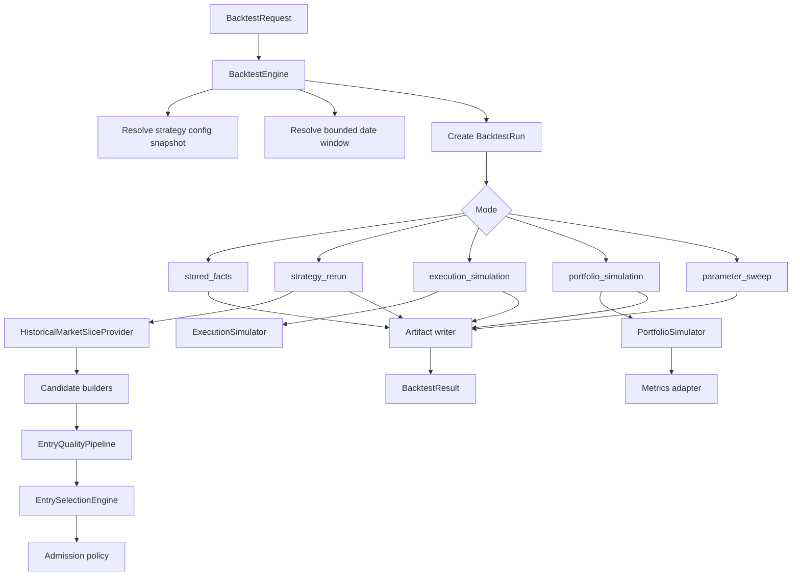

# BacktestEngine Architecture

Date: 2026-06-17

Status: active architecture and workstream plan. `docs/current_system_state.md` remains the runtime source of truth; this file tracks the BacktestEngine implementation sequence and remaining target modes.

Related:

- [System Architecture](../current_system_state.md)
- [Trading Engine Inspiration Repos](./2026-06-08_trading_engine_inspiration_repos.md)
- [Trading Engine Feature Matrix](./2026-06-13_trading_engine_feature_matrix.md)
- [Backtest System Recommendation](./2026-04-16_backtest_system_recommendation.md)
- [Config-Driven Runtime Prerequisite Plan](./2026-04-16_config_driven_runtime_prerequisite_plan.md)

## Decision

Use the direct domain name: `Backtest`.

The backend owner should be a new `services/backtest/` package centered on `BacktestEngine`. The existing `services/strategy_lab/historical_evaluator.py` should be displaced by the new package rather than preserved behind compatibility wrappers.

This is a clean replacement, not a revival of the removed historical wrappers. The old `spreads backtest`, `replay`, `audit`, and `analyze` command families remain retired unless a later bead deliberately introduces a new adapter over `BacktestEngine`.

## Problem

The current historical evaluator is useful but too narrow:

- It summarizes stored ticker-source, candidate, signal, decision, admission, intent, attempt, position, close, PnL, and ClickHouse coverage facts.
- It labels fidelity honestly as `stored_facts_current_model`.
- It cannot rerun a changed strategy profile or source model.
- It cannot simulate fills, repricing, order expiry, positions, exits, or PnL from historical market data.
- It has no persisted experiment registry.
- It has no standard metrics adapter for equity curves, drawdowns, Sharpe, Sortino, win rate, or rolling risk.

That means it answers "what happened according to stored facts?" but not yet "what would this current strategy have done over this window?"

## Goals

Backtest must:

1. Reuse the current live strategy spine:

   `ticker_source -> candidate -> signal -> decision -> admission -> intent -> attempt -> position -> close`

2. Keep live trading facts clean. Backtests write isolated run artifacts, not live candidate, decision, execution, or position rows.
3. Support stored-fact evaluation, strategy reruns, execution simulation, portfolio simulation, and parameter sweeps under one backend owner.
4. Label every result with explicit source, market-data, execution, fill, position, exit, PnL, and comparison fidelity.
5. Use library-backed analytics and dataframe tooling where they are standard.
6. Keep strategy selection, admission, execution, portfolio, and exit boundaries separate.
7. Make later CLI, API, and UI adapters thin surfaces over the backend engine.

## Non-Goals

- Do not embed LEAN, Zipline, Qlib, NautilusTrader, Backtrader, or a separate trading runtime.
- Do not create a second live execution orchestrator.
- Do not write simulated facts into live fact tables.
- Do not silently compare changed profiles against stored decisions.
- Do not add arbitrary strategy expression DSLs as the first step.
- Do not revive removed `replay`, `audit`, `analyze`, or old `backtest` wrappers.
- Do not build an operator app UI before the backend primitive is correct.

## Package Shape

Target package:

```text
packages/core/services/backtest/
  __init__.py
  models.py
  engine.py
  stored_facts.py
  market_slices.py
  windows.py
  feature_store.py
  strategy_rerun.py
  execution_simulation.py
  portfolio_simulation.py
  experiments.py
  metrics.py
```

Ownership:

| Module | Responsibility |
| --- | --- |
| `models.py` | `BacktestRequest`, `BacktestRun`, `BacktestMode`, `BacktestResult`, `BacktestArtifact`, `BacktestVariant`, and fidelity labels. Use `DomainModel`. |
| `engine.py` | Orchestrates modes, validates bounded windows, resolves strategy variants, coordinates artifact writes, returns compact summaries. |
| `stored_facts.py` | Moves the current stored-facts evaluator out of `strategy_lab` with equivalent behavior and better model boundaries. |
| `market_slices.py` | Point-in-time `HistoricalMarketSliceProvider` interfaces and concrete ClickHouse/Postgres providers. |
| `windows.py` | Shared bounded date-window normalization. |
| `feature_store.py` | Builds and reads compact historical feature frames for reruns and sweeps. |
| `strategy_rerun.py` | Reruns source/candidate/signal/decision flow against historical data. |
| `execution_simulation.py` | Simulates order acceptance, fills, expiry, quote freshness, repricing, cancel, and broker-denial outcomes. |
| `portfolio_simulation.py` | Projects positions, close decisions, marks, realized/unrealized PnL, and equity curves. |
| `experiments.py` | Persists run metadata, config snapshots, variant hashes, artifact pointers, and summary status. |
| `metrics.py` | Owns standard performance metrics through library adapters. |

## Modes

### `stored_facts`

Rolls existing stored facts across a bounded date window. This replaces the current evaluator.

Input:

- current or requested `trading_strategy_id` scope
- date window
- persisted facts
- ClickHouse coverage query

Output:

- source/candidate/signal/decision/admission/execution/position/close/PnL aggregates
- reason-code attribution
- market-data coverage
- fidelity labels

This mode must not pretend that a profile edit was rerun.

### `strategy_rerun`

Reruns current or proposed strategy configs over historical data.

Input:

- strategy catalog/profile snapshot or override set
- historical source universe
- historical market slices
- date/time schedule window

Output:

- synthetic backtest candidate, signal, decision, and admission artifacts
- blocker attribution by stage
- comparison to stored facts when available

This mode should reuse live candidate builders, quality profiles, entry selection, and admission policy where they are pure enough. If a live component is not pure enough, split the pure policy from runtime persistence rather than forking behavior.

Implemented in `spr-u44.4`: `strategy_rerun` runs active entry strategies through current config, point-in-time static or stored dynamic source scope, `HistoricalMarketSliceProvider`, current candidate builders, `EntrySelectionEngine`, current decision planning, and protection/portfolio admission artifacts. It writes only backtest run/artifact/variant rows and local result artifacts. It does not write live ticker-source, candidate, signal, decision, admission, intent, attempt, or position facts. Broker buying-power and allocation capacity are labeled as deferred to execution simulation so strategy reruns do not read the current broker account. When ClickHouse captured-chain coverage is insufficient for a full current candidate rebuild, the mode may fall back to stored trade-candidate payloads and labels candidate fidelity as `stored_trade_candidate_fallback`.

### `execution_simulation`

Simulates the execution lifecycle for selected decisions or generated intents.

Input:

- selected decision artifacts or stored selected decisions
- historical quote/trade ticks
- executor profile snapshot
- fill model

Output:

- simulated attempts
- simulated orders
- simulated fills
- denied or expired outcomes
- fill and execution fidelity labels

Fill assumptions must be explicit. A simulated fill is not a broker fill.

### `portfolio_simulation`

Projects positions, exits, and PnL from simulated or stored fills.

Input:

- simulated or stored fills
- close policy snapshot
- marks from historical data
- risk/protection policy snapshot

Output:

- position timeline
- close decisions
- realized and unrealized PnL
- equity curve
- drawdown series
- exit fidelity labels

### `parameter_sweep`

Runs bounded variant grids over profile/source/ranking/exit parameters.

Input:

- allowed variant dimensions
- bounded date window
- strategy scope
- run budget

Output:

- variant rankings
- sensitivity metrics
- artifacts per variant
- comparison fidelity labels

This mode can use vectorized libraries for speed, but the canonical lifecycle artifact still belongs to Backtest.

## Runtime Boundary

Backtest is allowed to reuse pure policy services:

- source resolution logic when backed by point-in-time facts
- candidate builders
- `EntryQualityPipeline`
- `EntrySelectionEngine`
- money and premium helpers in `core.money`
- admission policy logic that does not mutate live state
- close policy math
- execution order-shape validation logic

Backtest must not call:

- live Alpaca submission
- live broker sync
- live scheduler or worker paths
- live execution intent dispatch
- market recorder side effects
- alert delivery

If live code mixes policy with side effects, the implementation bead should extract the policy into a shared pure helper before backtest uses it.

## Data Ownership

### Postgres

Postgres owns durable run metadata and compact summaries:

- `backtest_runs`
- `backtest_artifacts`
- `backtest_variant_results`

Implemented in `20260617_0061`: the first stored-facts mode writes run state, request/config snapshots, summary/fidelity, result artifact pointers, and one current-catalog variant row per strategy. These tables are isolated backtest state; backtest runs must not write live candidate, decision, execution, or position facts.

Initial table sketch:

```text
backtest_runs
  backtest_run_id text primary key
  mode text not null
  state text not null
  requested_by text null
  strategy_ids jsonb not null
  start_date date not null
  end_date date not null
  config_snapshot jsonb not null
  request_json jsonb not null
  summary_json jsonb not null default '{}'
  fidelity_json jsonb not null default '{}'
  artifact_root text null
  error_text text null
  created_at timestamptz not null
  started_at timestamptz null
  completed_at timestamptz null

backtest_artifacts
  backtest_artifact_id text primary key
  backtest_run_id text not null
  artifact_kind text not null
  storage_kind text not null
  uri text not null
  content_type text null
  row_count bigint null
  byte_count bigint null
  schema_json jsonb not null default '{}'
  metadata_json jsonb not null default '{}'
  created_at timestamptz not null

backtest_variant_results
  backtest_variant_id text primary key
  backtest_run_id text not null
  trading_strategy_id text not null
  config_hash text not null
  variant_hash text not null
  parameters_json jsonb not null
  summary_json jsonb not null
  metrics_json jsonb not null
  fidelity_json jsonb not null
  rank integer null
  created_at timestamptz not null
```

### ClickHouse

ClickHouse owns high-volume historical market data:

- option quote ticks
- option trade ticks
- compact quote snapshots
- future feature-frame tables if Parquet is not enough

Backtest reads ClickHouse through provider interfaces. It should not embed ClickHouse query details inside strategy logic.

### Parquet or Arrow Artifacts

Large per-run outputs should be stored outside Postgres:

- candidates
- feature snapshots
- signals
- decisions
- simulated attempts
- simulated fills
- position timeline
- close decisions
- equity curve

The artifact index in Postgres should point to these files.

The default local artifact root is `outputs/backtest_runs`, which is ignored by git. A request can override the root through `BacktestRequest.artifact_root`.

## Historical Data Providers

Backtest needs a historical sibling of the live market data boundary:

```text
AlpacaMarketSliceProvider       -> live market slices
HistoricalMarketSliceProvider   -> point-in-time historical market slices
```

`HistoricalMarketSliceProvider` should return the same normalized `SymbolMarketSlice` shape candidate builders already consume.

Implemented in `spr-u44.3`: `services/backtest/market_slices.py` provides `HistoricalMarketSliceProvider` and `HistoricalMarketSliceRequest`. The provider reads ClickHouse latest option quote snapshots and trade ticks, Postgres ticker-source observations, candidate diagnostics/examples, trade-candidate metadata when present, and earnings consensus rows. Current fidelity is explicit: ClickHouse provides captured-contract coverage, not a full historical options-chain archive; contract metadata may be partially OCC-parsed without open interest, underlying bars may be unavailable, and Greeks depend on stored metadata or the local Greeks provider.

Provider responsibilities:

- resolve point-in-time underlying bars and quotes
- load option contract metadata by symbol/date
- load quote and trade ticks for candidate legs
- compute or load expected moves and greeks with fidelity labels
- distinguish missing data, stale data, approximated data, and full data

This provider is the most important correctness boundary. If it is wrong, the backtest is theater.

## Fidelity Labels

Every run and variant must carry labels similar to:

```text
source_fidelity:
  stored_ticker_source_facts
  rerun_static_source
  rerun_dynamic_source_from_stored_observations
  rerun_dynamic_source_from_provider_history

candidate_fidelity:
  stored_candidate_facts
  rerun_candidate_builder
  rerun_candidate_builder_with_missing_chain_data
  stored_trade_candidate_fallback

market_data_fidelity:
  full_quote_trade_coverage
  partial_quote_coverage
  quote_snapshot_only
  bars_only
  missing_market_data

execution_fidelity:
  broker_fill_facts
  simulated_quote_cross_fill
  simulated_midpoint_fill
  simulated_no_fill
  no_execution_evidence

pnl_fidelity:
  broker_position_facts
  simulated_position_marks
  synthetic_marks_from_midpoint
  no_pnl_evidence

comparison_fidelity:
  stored_facts_no_profile_rerun
  strategy_profile_rerun
  parameter_sweep_rerun
```

No summary should show a single result number without the fidelity context needed to interpret it.

## Libraries

Use:

- `polars` for large historical frames, joins, and artifact transforms.
- `quantstats` or `empyrical-reloaded` for standard return, drawdown, and risk metrics.
- `vectorbt` only for bounded fast parameter sweeps over clean matrices.

Do not use these libraries as the trading lifecycle owner. They are adapters below `BacktestEngine`, not the engine.

Continue using:

- `core.money` for premium, notional, exposure, PnL, and tick math.
- Pydantic `DomainModel` for owned request/result contracts.
- current strategy catalog/profile loading for config snapshots and variants.

## Metrics

Backtest metrics should include:

- net PnL
- realized PnL
- unrealized PnL
- return on risk
- win rate
- average win
- average loss
- profit factor
- max drawdown
- exposure time
- fill rate
- selection rate
- admission approval rate
- close decision rate
- average holding time
- slippage estimate
- quote coverage ratio
- stale/missing mark counts

Metrics are only meaningful with the associated fidelity labels.

## BacktestEngine Flow



## Implementation Order

1. Done: create `services/backtest/` and move stored-facts evaluation into it.
2. Done: add strict backtest DomainModels and `BacktestEngine`.
3. Done: add run, variant, and artifact persistence for stored-facts mode.
4. Done: add `HistoricalMarketSliceProvider`.
5. Done: add `strategy_rerun` mode.
6. Add `execution_simulation` mode.
7. Add `portfolio_simulation` and metrics adapters.
8. Add `parameter_sweep`.
9. Add a narrow CLI/API adapter only after the backend mode contracts are stable.
10. Update `docs/current_system_state.md` only after the implemented owner is live.

## Validation Strategy

Default validation should stay runtime-oriented and narrow:

- `uv run spreads config validate --json`
- direct import smoke for `core.services.backtest`
- one-day `stored_facts` parity against the current evaluator before deletion
- ClickHouse coverage smoke for referenced option symbols
- artifact write/read smoke against the configured local artifact root
- strategy rerun smoke over one strategy and one date
- strategy rerun smoke should assert zero live fact-table deltas and no broker buying-power/allocation evidence when capacity is deferred
- execution simulation smoke against a tiny selected-decision fixture or a real stored selected decision
- no live facts written by backtest runs

Automated tests should be added only when explicitly requested. The default close condition is targeted smoke plus live stack safety checks.

## Workstream Beads

The Beads workstream should be an epic with children in this order:

1. Create `BacktestEngine` package and move stored-facts mode.
2. Add backtest run and artifact persistence.
3. Build `HistoricalMarketSliceProvider`.
4. Done: add strategy rerun mode.
5. Add execution simulation mode.
6. Add portfolio, exit, PnL simulation, and metrics.
7. Add parameter sweep and variant ranking.
8. Add narrow adapter and current docs cutover.

The first bead should preserve behavior while changing ownership. Later beads can rewrite internals aggressively where live code is too side-effect-heavy to reuse cleanly.

## Cutover Rule

When the new package is implemented:

- delete or move the old `services/strategy_lab/historical_evaluator.py`
- update imports to `core.services.backtest`
- update `docs/current_system_state.md`
- update repo-local skills that still say `strategy_lab` owns historical evaluation
- keep old planning docs as historical context only

No shim should survive just to preserve the old name.
