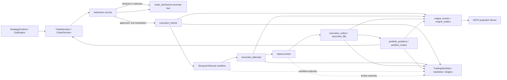

# ADR: Single-Authority Execution Lifecycle Storage

Date: 2026-07-15

Tracker: `spr-n65`

Status: approved by Ade on 2026-07-15; implementation proceeds through
`spr-t4z` and then `spr-0jf`

Related implementation beads:

- `spr-t4z`: eliminate divergent dual execution-intent state
- `spr-0jf`: remove abandoned lifecycle tables and the portfolio-position mirror

Canonical current-state reference:

- [System Architecture](../current_system_state.md)

Historical inputs:

- [Target Trading Lifecycle Object Model](./2026-06-03_target_trading_lifecycle_object_model.md)
- [Lifecycle Storage Shape](./2026-06-03_lifecycle_storage_shape.md)
- [Trading Lifecycle State Machines](./2026-06-03_trading_lifecycle_state_machines.md)
- [Trading Engine Inspiration Repos](./2026-06-08_trading_engine_inspiration_repos.md)

Diagram source:

- [Single-authority lifecycle flow](../diagrams/planning/2026-07-15_single_authority_execution_lifecycle_storage.mmd)

## Decision

Spreads will keep and harden the lifecycle tables used by the live runtime. It
will not complete the abandoned June migration into the parallel `trade_*`
attempt, order, fill, position, close, reconciliation, and event tables.

The entry and close branches converge on the same money path:

```text
TradeSignal -> TradeDecision -----+
                                  |
PortfolioPosition -> CloseDecision+-> AdmissionDecision
                                      -> ExecutionIntent
                                      -> ExecutionAttempt
                                      -> ExecutionOrder / ExecutionFill
                                      -> PortfolioPosition / PositionClose
```

The consequential choices are:

1. `trade_admissions` remains the durable AdmissionDecision fact.
2. `execution_intents` is the only executable-intent table and the only
   Postgres owner of intent state.
3. There is no separate ExecutionRequest table. A selected trade or close
   decision is the source request, and AdmissionDecision already snapshots the
   requested quantity, notional, maximum loss, policy, capability, evidence,
   and outcome.
4. Blocked and unknown admissions are persisted without creating an intent.
   Only approved admissions create an `execution_intents` row.
5. `execution_attempts` becomes the child of `execution_intents`; the reverse
   mutable attempt pointer is removed from the intent.
6. `portfolio_positions` remains the one position projection.
   `trade_close_decisions` and `position_closes` reference it directly.
7. `engine_events` plus `engine_outbox` is the only lifecycle event/audit
   spine. `execution_intent_events` and `trade_lifecycle_events` are removed.
8. Intent transitions update the intent row and append its engine event/outbox
   record in one Postgres transaction. The current full-row upsert transition
   pattern is replaced with an expected-state/version transition operation.
9. Temporal remains authoritative for in-flight workflow execution and timers;
   Alpaca remains authoritative for broker order state; Postgres remains
   authoritative for Spreads domain facts and projections. Operator views
   correlate those authorities rather than inventing another state store.

This is a clean cutover. The final code contains no dual writer, compatibility
repository, shadow table, view alias, or fallback reader.

## Context

### Operator journey and success criteria

An operator must be able to start from a strategy decision or open position and
follow one unambiguous lineage through admission, intent, workflow, broker
attempt, order/fill, position impact, and close. The answer to “what state is
this trade in?” must not depend on which table or operator surface is queried.

Success means:

- one mutable owner for each lifecycle state;
- no approved attempt without approved admission and one parent intent;
- no blocked admission represented as a revoked executable intent;
- one canonical position projection;
- one append-only lifecycle event stream;
- deterministic workflow, broker, and database correlation;
- no loss of active money-path work during migration;
- current operator, backtest, and strategy-ledger readers continue from the
  canonical tables.

### Live evidence

The following was observed in the live Postgres database on 2026-07-15. These
counts are a design snapshot; the implementation must rerun the gates instead
of hard-coding them.

| Evidence | Observed state |
| --- | --- |
| `trade_admissions` | 263 rows: 21 approved entry, 240 blocked entry, 2 approved close |
| `trade_execution_intents` | 263 rows: 23 pending and 240 revoked |
| `execution_intents` | 125 rows |
| Rows shared by both intent tables | 23 |
| Shared rows with different lifecycle state | 23 of 23 |
| Shared rows with different claim token | 22 of 23 |
| Canonical intents without an admission | 102 terminal historical rows |
| `execution_attempts` / orders / fills | 110 / 110 / 74 rows |
| Parallel `trade_*` attempts / orders / fills | 0 / 0 / 0 rows |
| `portfolio_positions` / `trade_positions` | 33 / 2 rows |
| `position_closes` / `trade_position_closes` | 33 / 0 rows |
| `trade_close_decisions` | 46 rows over 2 mirrored positions; 2 link to intents |
| `engine_events` / `execution_intent_events` | 30 / 664 rows |
| `trade_lifecycle_events` / reconciliation observations | 0 / 0 rows |
| Active intents, attempts, or positions at audit time | 0 / 0 / 0 |

The 240 revoked `trade_execution_intents` rows are not failed executable work.
They are blocked AdmissionDecisions forced through a non-null foreign key to a
placeholder intent. The 23 approved rows are dual-written and then abandoned
in `pending` while `execution_intents` advances to filled, failed, expired, or
superseded. The schema therefore encodes two different concepts under the same
identifier and mutable state vocabulary.

### Root cause

The June lifecycle schema was created as a future target before its live
writers were cut over. Later work correctly evolved the existing
`execution_*`, `portfolio_positions`, and `position_closes` tables into the
active lifecycle, but it also began writing selected facts into the unused
target family. The intended breaking replacement became a partial dual write.

The historical object model explicitly allowed reusing current table names
when they cleanly matched the target. This ADR exercises that option now that
the working runtime provides stronger evidence than the speculative schema.

## Scope

In scope:

- request/admission/intent ordering and identity;
- intent state and workflow correlation;
- attempt, order, fill, position, close, reconciliation, and event ownership;
- foreign-key direction and migration of existing lineage;
- writer and reader cutover;
- operator/backtest projection impact;
- archival, rollout, rollback, and live validation.

Out of scope:

- changing strategy selection or entry-quality policy;
- changing Temporal workflow types, workflow IDs, task queues, or retry policy;
- changing the Alpaca adapter or broker-order semantics;
- event sourcing the system from `engine_events`;
- retaining an unused reconciliation-observation table for a hypothetical
  future caller;
- rewriting historical rows to pretend evidence existed when it did not;
- adding a new service, queue, database, or generic lifecycle framework.

## Inspiration Patterns

| Inspiration | Pattern borrowed | Spreads-native application |
| --- | --- | --- |
| QuantConnect LEAN | Keep signal, portfolio/risk, and execution stages distinct. | Decision and AdmissionDecision precede the executable intent; blocked risk never becomes execution work. |
| NautilusTrader | Explicit execution/risk boundaries and concrete transition denials. | Typed lifecycle transitions and one repository transition operation reject stale or invalid state changes. |
| Hummingbot V2 | Controllers emit actions; executors own order lifecycle. | Strategy/close policy emits approved intent work; Temporal lifecycle workflows and execution services own submit, refresh, cancel, and reprice. |
| Zipline/Freqtrade | Do not collapse facts, filters, and protection policy. | Signal/decision evidence stays separate from admission and execution state. No framework machinery is copied. |

Spreads does not embed any inspiration runtime. The design keeps the current
modular monolith, SQLAlchemy/Postgres storage, Temporal workflows, and Alpaca
adapter.

## Containers And Authority



| Container or external system | Authority |
| --- | --- |
| StrategyRuntime / ExitEngine | Produce selected trade or close decisions; never broker state. |
| Admission service | Produce immutable approved, blocked, or unknown AdmissionDecision facts. |
| Execution-intent service/repository | Create approved executable commands and own Postgres intent transitions. |
| Temporal lifecycle workflow | Own in-flight orchestration, durable timers, retries, cancellation, and workflow execution status. |
| Execution service | Create and reconcile attempts, orders, and fills through the Alpaca adapter. |
| Alpaca | External authority for broker order acceptance, status, fill, and inventory observations. |
| PortfolioEngine / session positions | Own strategy/session position attribution and PnL projection in `portfolio_positions`. |
| Engine event repository | Own append-only material lifecycle events and transactional outbox records. |
| TradingOpsState / StorageOpsState | Read-only composition; never a lifecycle writer. |
| NATS JetStream | Projection transport after outbox acknowledgement; never source of truth. |

## Interfaces And Invariants

### Admission handoff

The service interface is conceptually:

```text
record_admission(decision, request_snapshot) -> AdmissionDecision

if AdmissionDecision.state == approved:
    create_execution_intent(AdmissionDecision, immutable_request) -> ExecutionIntent
else:
    stop
```

The admission and optional intent creation occur in one transaction. Approved
creation also appends `engine.command_accepted` and its outbox row in that
transaction. Blocked/unknown admission appends `engine.command_rejected` and
does not allocate an intent ID as executable work.

Entry and close paths use the same contract:

- entry admission references `trade_signal_id` and `trade_decision_id`;
- close admission references `position_id` and `close_decision_id`;
- manual or synthetic validation identifies its source through
  `source_object_type` and `source_object_id` and still produces admission;
- every approved post-cutover intent references exactly one admission;
- one approved admission produces at most one intent;
- every blocked/unknown admission references no intent because no intent
  exists.

A bounded reprice or replacement creates a new replacement AdmissionDecision
over the changed executable terms and then a successor intent. It does not
reuse the original admission as if quantity, price, freshness, and policy were
unchanged. Canceling a working attempt is a Temporal/execution command against
that attempt, not a new intent kind.

### Intent transition

All mutable intent changes go through one narrow repository operation:

```text
transition_execution_intent(
    execution_intent_id,
    expected_state,
    expected_version,
    to_state,
    workflow_correlation_patch,
    event
)
```

The operation:

1. locks or compare-and-swaps the current row;
2. validates the transition with `core.services.trading_lifecycle`;
3. changes only lifecycle/correlation columns, never the immutable request;
4. increments `state_version`;
5. inserts one idempotent `engine_events` row with that aggregate version;
6. inserts its `engine_outbox` row;
7. commits all three changes together.

There is no generic full-row upsert for transitions. Intent creation remains
idempotent by stable intent ID and slot/idempotency contract. Repeated provider
delivery either observes the committed version or is rejected as stale.

### Attempt and broker facts

- `execution_attempts.execution_intent_id` is the parent link.
- One intent has at most one direct attempt in the current execution model.
  Repricing/replacement creates a successor intent and successor attempt.
- A replacement intent carries `supersedes_execution_intent_id`; the reverse
  successor is queried, not stored as a second mutable pointer.
- Orders and fills remain immutable broker facts below an attempt.
- Broker refresh may update the latest order snapshot fields, but it cannot
  change strategy decision, admission, or position ownership.
- `submit_unknown` reconciles by client order ID before replacement.

### Position and close facts

- `portfolio_positions` is the only position projection.
- `trade_close_decisions.position_id` references `portfolio_positions`.
- `position_closes` records fill/reconciliation impact and references the
  position, close decision when present, intent when present, and attempt.
- The position projection may denormalize immutable strategy/admission lineage
  for operator queries, but it cannot become a second broker-order authority.
- Deleting a parent money-path fact must not cascade away historical money
  facts. New/rewired lifecycle foreign keys use restrictive deletion; explicit
  archival is separate from runtime mutation.

### Event facts

`engine_events` is an append-only audit and projection-fanout spine, not an
event-sourced replacement for relational lifecycle tables. Material events
include command accepted/rejected, state transitioned, workflow started or
completed, broker submission requested/unknown, broker order/fill observed,
position impact, and reconciliation action requiring operator awareness.

Routine refresh chatter does not become a lifecycle event. Temporal history
retains workflow-level execution details; Postgres domain rows retain current
facts; broker payloads remain under order/fill/attempt storage.

## Target Table Decisions

| Current table | Decision | Target role and required change |
| --- | --- | --- |
| `trade_signals` | Keep | Canonical account-agnostic signal fact. |
| `trade_decisions` | Keep | Canonical strategy decision fact. |
| `trade_admissions` | Keep and reshape | Canonical AdmissionDecision. Add `source_object_type`, `source_object_id`, nullable FK-backed `position_id` and `close_decision_id`. Remove reverse `execution_intent_id` and `execution_attempt_id`. Persist all entry and close outcomes. |
| `trade_execution_intents` | Drop | Placeholder/dual-write table. Blocked rows remain represented by admissions; approved rows map to existing `execution_intents`. |
| `execution_intents` | Keep and harden | Sole executable-intent table. Add `admission_decision_id`, `close_decision_id`, `position_id`, `claimed_at`, `workflow_id`, `workflow_run_id`, `supersedes_execution_intent_id`, and `state_version`. Normalize `action_type` to durable `intent_kind` values `open` or `close`. Remove `execution_attempt_id`, `strategy_position_id`, and `superseded_by_id`. Request payload becomes immutable after creation. |
| `execution_intent_events` | Archive then drop | Replaced by transactional `engine_events`/outbox. No runtime reader depends on it. |
| `trade_execution_attempts` | Drop | Empty alternate table. |
| `execution_attempts` | Keep and harden | Sole attempt fact. Add indexed FK `execution_intent_id`; backfill from the current intent reverse pointer. Existing immutable lineage columns may remain for query history but are copied only at creation and never own state. |
| `trade_broker_orders` | Drop | Empty alternate table. |
| `execution_orders` | Keep | Sole broker-order fact below an attempt. |
| `trade_broker_fills` | Drop | Empty alternate table. |
| `execution_fills` | Keep | Sole immutable broker-fill fact below an attempt/order. |
| `trade_positions` | Drop | Two-row mirror used only for close-decision joins. |
| `portfolio_positions` | Keep | Sole strategy/session position and PnL projection. |
| `trade_close_decisions` | Keep and rewire | Canonical close decision fact. Point `position_id` at `portfolio_positions`; remove the reverse `execution_intent_id`, because the child intent references `close_decision_id`. |
| `trade_position_closes` | Drop | Empty alternate table. |
| `position_closes` | Keep and extend | Sole close-impact fact. Add nullable `close_decision_id` and `execution_intent_id`; retain `execution_attempt_id`. Historical rows remain nullable when evidence cannot prove lineage. |
| `trade_reconciliation_observations` | Drop | Empty and unwritten. Current reconciliation truth remains broker sync state, attempt/order/position reconciliation fields, and material engine events. Add a new fact only with a real consumer and retention contract. |
| `trade_lifecycle_events` | Drop | Empty alternate event table. |
| `engine_events` / `engine_outbox` | Keep and harden writers | Sole material lifecycle event and outbox spine. State transitions append in the same transaction as the domain mutation. |

`TARGET_LIFECYCLE_TABLES` and schema-readiness checks must be deleted or
rewritten around actual capabilities. Runtime code must not treat the presence
of abandoned tables as evidence that a lifecycle is ready.

## Caller And Model Cutover Inventory

| Current owner/caller | Required cutover |
| --- | --- |
| `storage/lifecycle_models.py` | Retain signal, decision, admission, and close-decision models. Remove trade intent, alternate attempt/order/fill/position/close/reconciliation/event models and the target-table manifest. |
| `storage/execution_models.py` | Make intent, attempt, order, fill, canonical position, and position close match the target relationship direction. Remove the local intent-event model. |
| `services/trading_engine/strategy_runtime_admission.py` | Persist AdmissionDecision first; create one intent only for approved admission; never construct a revoked placeholder intent. |
| `storage/execution/intents.py` | Replace the dual handoff/full upsert/local-event API with idempotent creation plus expected-state/version transitions that append engine event/outbox records transactionally. |
| `services/execution_intents/shared.py` | Stop reconstructing and overwriting the full row. Use immutable creation, narrow transitions, and child-owned attempt/replacement links. |
| `services/execution_intents/workflow_starter.py` | Persist explicit workflow correlation and claimed state through the transition API; keep Temporal workflow identity authoritative. |
| `services/execution_intents/attempt_planner.py`, `services/execution/`, and broker activities | Create/reuse attempts by `execution_intent_id`; preserve client-order idempotency and `submit_unknown` reconciliation. |
| `services/execution_intents/repricing.py` | Create a replacement AdmissionDecision and successor intent; use successor-owned supersession lineage; cancel the old attempt through its workflow. |
| `services/execution_intents/maintenance.py` | Remove dependence on placeholder trade intents and local intent events. Repairs remain exact, terminal-only, and event-idempotent. |
| `services/trading_engine/exit_runtime.py` and `services/exit_manager.py` | Persist hold, blocked, unknown, and approved close admissions/decisions against canonical positions; remove trade-position and trade-intent writes plus reverse intent attachment. |
| `storage/engine_facts/lifecycle.py` | Delete trade-intent and trade-position upserts; join close decisions directly to `portfolio_positions`; write only canonical admission/close facts. |
| `services/ops/trading/*`, `services/positions.py`, and execution CLI/API adapters | Read canonical intent/attempt/position/close relationships and `engine_events`; remove schema-presence and fallback logic for abandoned tables. |
| `services/backtest/*` | Keep isolated simulated artifacts, but align stored-facts joins and lifecycle vocabulary with canonical admissions/intents/positions. Do not write live lifecycle tables. |
| `services/paper_lifecycle_smoke.py` and other manual/synthetic creators | Produce a synthetic-validation AdmissionDecision before creating an intent; no post-cutover bypass is exempt from admission lineage. |
| `storage/execution_repository.py` and `storage/engine_fact_repository.py` | Replace broad table-family readiness checks with the exact canonical capability each repository needs. |
| Active docs and repo skills | After live cutover, update `current_system_state.md` first, then package instructions/skills and planning status. Remove guidance that names the abandoned schema as a target. |

## Relationship Direction

The final normalized relationship direction is:

```text
TradeDecision / CloseDecision
            |
            v
     AdmissionDecision
            |
            v
      ExecutionIntent
            |
            v
      ExecutionAttempt
            |
       +----+----+
       v         v
     Orders     Fills
                   |
                   v
        PortfolioPosition
                   |
                   v
          PositionClose
```

Child rows reference their causal parent. Reverse relationships are queries,
not stored mutable pointers. The only deliberate denormalization is immutable
operator/query lineage copied at creation or projection time.

## Migration And Rollout

The implementation graph is deliberately ordered:

```text
spr-n65 approval
  -> spr-t4z: admission/intent/attempt/event authority cutover
  -> spr-0jf: position/close rewire and abandoned-table deletion
  -> current-system documentation update and normal enablement
```

Each implementation bead owns one transactional schema migration and its
matching code revision. There is no dual-write bridge between them. The
default rollout keeps the money path paused across both migrations; if they
are deployed in separate maintenance windows, `spr-t4z` must leave the old
position mirror behavior unchanged and `spr-0jf` must be the next lifecycle
storage change.

### Gate 0: prepare and inventory

Implementation must generate an exact migration report immediately before the
cutover:

- row/state counts for all tables in the decision matrix;
- every admission joined to its placeholder and canonical intent;
- approved admissions missing a canonical intent;
- non-approved admissions that do have a canonical intent;
- duplicate/missing intent-to-attempt relationships;
- replacement lineage cycles or multiple successors;
- close-decision position IDs absent from `portfolio_positions`;
- open Temporal lifecycle workflows and active intents/attempts/positions;
- container/image revision and Alembic revision.

Any unexplained row fails the gate. The migration does not guess.

### Gate 1: quiesce the money path

Perform the cutover off-hours:

1. pause routine schedules that can create entry/manage/lifecycle work;
2. stop lifecycle and runtime workers after current activities settle;
3. verify zero open lifecycle workflows, active intents, active attempts, and
   open positions, or intentionally reconcile/close them before proceeding;
4. keep capture/data infrastructure independent unless it imports the changed
   models;
5. take a verified Postgres backup plus a schema/data export of every table
   being transformed or dropped.

The migration aborts rather than introducing a dual-write bridge when the
money path cannot be quiesced.

### Gate 2: transactional data cutover

The `spr-t4z` migration performs the authority cutover in a Postgres
transaction where supported:

1. add the admission/intent/attempt FK, correlation, lineage, and version
   columns;
2. map approved `trade_admissions` to canonical intents;
3. preserve blocked/unknown admissions and remove their placeholder-intent
   requirement;
4. normalize `buy -> open` and `sell -> close` intent kinds;
5. reverse intent/attempt links into `execution_attempts.execution_intent_id`;
6. convert `superseded_by_id` into successor-owned
   `supersedes_execution_intent_id` and reject forks/cycles;
7. backfill explicit workflow correlation from current payload/history where
   evidence exists;
8. install restrictive/unique indexes and constraints;
9. archive and drop `trade_execution_intents` and
   `execution_intent_events` plus their displaced FKs, columns, models, and
   writers.

The blocked `spr-0jf` migration then completes storage cleanup:

1. rewire close decisions to `portfolio_positions`;
2. add and backfill close-decision/intent lineage on `position_closes` where
   evidence proves it;
3. remove the `trade_positions` copier and its query joins;
4. archive and drop the empty alternate attempt/order/fill/close,
   reconciliation, and lifecycle-event tables;
5. remove `TARGET_LIFECYCLE_TABLES`, abandoned ORM models, schema-readiness
   checks, stale planning guidance, and remaining readers.

At the 2026-07-15 snapshot, the expected intent mapping is:

- 240 blocked entry admissions survive; their 240 revoked placeholder intents
  do not migrate;
- 23 approved admissions link to their existing canonical intents; the
  canonical state wins and the stale `pending` state is discarded;
- 102 terminal historical canonical intents without admissions remain
  read-only historical rows with nullable modern lineage. The migration and
  operator surfaces label missing lineage truthfully; no synthetic approval is
  invented;
- 92 current intent-to-attempt links reverse into the attempt child;
- 18 replacement links become successor-owned lineage.

Those numbers are assertions only for the audit snapshot. Changed counts are
allowed when every changed row has an explained classification.

### Gate 3: code cutover

Each migration ships with the code that exclusively uses its resulting
schema. Across the ordered releases:

- replace `upsert_admission_intent_handoff` with the canonical admission and
  optional-intent transaction;
- make blocked close admissions durable even though no intent is created;
- replace full intent upserts with create and transition operations;
- emit engine event/outbox records transactionally;
- update workflow starter, attempt planner, repricing, repair, and maintenance
  callers to the target columns and lineage direction;
- update close-decision and position-close repositories/readers;
- remove duplicate ORM models, repositories, readiness checks, and event
  writers;
- update TradingOpsState, strategy ledger, backtests, and CLI/API adapters;
- update `docs/current_system_state.md` only after the runtime cutover is live.

All affected worker and API containers must run the same code revision before
the money path is re-enabled.

### Gate 4: observation and enablement

1. restart API and required workflow lanes;
2. verify Alembic head, schema health, task-queue pollers, and no old model/table
   references;
3. run a blocked admission smoke and prove it creates admission only;
4. run an approved observation/paper smoke and prove one intent, one workflow,
   one attempt, and one event chain;
5. run a close hold/blocked/selected sequence against canonical positions;
6. inspect Temporal and Postgres correlation by workflow, intent, attempt, and
   position IDs;
7. verify TradingOpsState, StorageOpsState, jobs, execution list/inspect,
   positions, strategy ledger, and bounded backtest reads;
8. re-enable normal strategy routines only after the observation gates pass.

## Rollback Boundary

Before either migration transaction commits, rollback is normal transaction
and image rollback.

After a migration commits but before any new intent is allowed, rollback is
the verified database restore plus its previous image. This is why the money
path remains paused through validation.

After the first post-cutover intent is admitted, the old code cannot be safely
re-enabled because its required tables and relationship directions no longer
exist. Recovery is forward-fix only unless the operator intentionally restores
the pre-cutover database and accepts losing all post-cutover domain writes.
This boundary must be called out in the rollout runbook before enablement.

## Failure Modes And Mitigations

| Failure mode | Detection | Mitigation / recovery |
| --- | --- | --- |
| Open workflow writes during DDL | Temporal visibility, active-state queries, worker logs | Quiesce required lanes; migration gate aborts on active work. |
| Stale intent update overwrites a newer state | Expected state/version mismatch | Compare-and-swap transition and transactional event; stale caller reloads or fails closed. |
| Admission/intent split transaction | Approved admission missing intent query | Create both plus event in one transaction; exact repair remains terminal-only and idempotent. |
| Broker accepted order but local submit is uncertain | `submit_unknown`, broker lookup by client order ID | Temporal retry/reconcile; never create replacement until broker non-existence is established. |
| Close decision points at mirror-only position | FK preflight | Assert every close position exists canonically before rewire; abort otherwise. |
| Historical lineage cannot be proven | Null modern FK and migration report | Preserve truthful null/read-only history; do not synthesize approvals or decisions. |
| Event history loss | Backup/export verification and row counts | Archive old intent events before drop; do not replay noisy refresh events into the material engine stream. |
| Mixed container revisions | Docker image/revision check and import errors | Restart every affected service before enablement; old code has no compatibility path. |
| Operator views disagree after cutover | Shared IDs/count comparison across shipped CLI surfaces | Update service-owned projections in the same bead; no frontend-owned fallback joins. |

## Scaling And Retention

The lifecycle volume is small relative to market data. Postgres remains the
correct store; no new cache, stream processor, or database is justified.

- indexes follow active state, strategy/date, parent FK, broker ID, workflow
  ID, and replacement lineage queries;
- engine events/outbox use existing sequence and idempotency indexes;
- broker payload retention remains under attempts/orders/fills;
- Temporal history retention is handled by the Temporal hardening beads;
- lifecycle facts are not periodically deleted from the live money path;
- future archival requires an explicit retention and operator-history bead.

## Alternatives Rejected

### Complete the June `trade_*` cutover

Rejected. The alternate attempt/order/fill/position/close/event tables have no
live writers and almost no data, while the active tables have working services,
operator reads, workflow activities, and history. Migrating into unused clones
would add risk without improving the domain boundary.

### Keep dual writes until confidence improves

Rejected. Dual writes created the current drift and make it impossible to name
one authority. Observation happens after a quiesced breaking cutover, not
through permanent shadow state.

### Rename `trade_execution_intents` to `execution_requests`

Rejected. TradeDecision/CloseDecision plus AdmissionDecision already captures
the source request and admission snapshot. A request table would duplicate
identity, payload, policy, and lifecycle semantics while providing no new
owner or consumer.

### Make `engine_events` the event-sourced database

Rejected. Spreads needs straightforward relational facts and projections.
`engine_events` is an audit/outbox spine, not a reason to build custom replay,
aggregate reconstruction, or event-store infrastructure.

### Keep `execution_intent_events` as a local event log

Rejected. It has no runtime reader and duplicates material transitions without
the outbox, aggregate version, or operator ownership of `engine_events`.
Temporal already preserves workflow detail; broker/order tables preserve broker
detail.

## Consequences

Positive:

- removes two intent states, two event logs, two position projections, and six
  empty lifecycle table alternatives;
- aligns storage with the live service boundaries already documented in
  `current_system_state.md`;
- makes blocked admission truthful without fake revoked work;
- makes transition concurrency and event publication explicit;
- preserves Temporal and Alpaca as robust external authorities instead of
  reimplementing their state machines in another local subsystem;
- reduces future operator and backtest query ambiguity.

Costs:

- breaking migration and coordinated off-hours rollout;
- broad but mechanical caller updates across execution, close, ops, and
  backtest readers;
- historical terminal rows keep explicit lineage gaps rather than being
  normalized into a story the evidence cannot support;
- rollback becomes restore-only after the first new post-cutover intent.

## Review Questions

Approval of this ADR confirms all of the following:

1. AdmissionDecision precedes ExecutionIntent, and no ExecutionRequest table is
   introduced.
2. The active `execution_*`, `portfolio_positions`, `position_closes`, and
   `engine_events` family wins over the abandoned parallel schema.
3. `execution_intent_events` is archived and removed rather than retained as a
   second event log.
4. Child-owned foreign keys replace reverse mutable pointers.
5. A quiesced breaking cutover is preferred over a dual-write bridge.
6. Historical gaps remain truthful and nullable rather than being populated
   with synthetic lifecycle facts.
