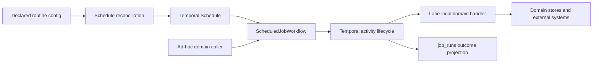

# Temporal Routine Authority

Tracker: `spr-58o`, `spr-of1`, `spr-0yq`

Status: implemented 2026-07-15

## Context

Routine execution previously split authority across three control planes:

1. Temporal workflow and activity state;
2. mutable Postgres `job_runs` state with application requeue semantics; and
3. Postgres singleton leases plus a second in-activity due-slot decision.

That duplicated provider capabilities and made worker-loss recovery require
manual reconciliation among states that could legitimately disagree. It also
made `retry_count` describe an application mechanism instead of the execution
attempt visible in Temporal.

## Decision

Temporal is the sole orchestration authority for routine work. It owns:

- workflow and activity identity;
- schedule firing and scheduled-slot time;
- overlap and duplicate-start control;
- transient activity retry and backoff;
- heartbeat timeout and worker-loss recovery;
- cancellation and activity time bounds; and
- authoritative running/closed execution state.

Postgres `job_runs` is a durable domain/operator projection. It owns queryable
inputs, timing, current projected status, Temporal run lineage, activity-attempt
count, bounded result, and last failure. It does not decide whether Temporal
should retry or whether another routine may run.

## Identity and Duplicate Control

Scheduled routine schedules use stable IDs derived from `job_key`. Temporal
adds the scheduled timestamp to each workflow ID; the provider's
`TemporalScheduledStartTime` search attribute is the authoritative slot. The
job-run ID is deterministically derived from `job_key` and that slot.

Ad-hoc callers use the same `ScheduledJobWorkflow` and activity. Their workflow
ID is deterministic from the domain job identity. Starts use `USE_EXISTING`
for a concurrent conflict and `ALLOW_DUPLICATE` after a closed execution. Thus
duplicate concurrent launches converge on one Temporal execution without a
separate routine lease.

The shared launcher returns the actual Temporal run selected by the server.
The ad-hoc job-run ID is derived from the job key and that run ID, so a caller
that receives an existing execution cannot report a phantom projection ID.

`job_runs.orchestration_id` stores the Temporal workflow run ID. Reusing a
job-run ID from a different Temporal run fails closed as a non-retryable
projection conflict.

## Retry and Timeout Contract

Routine activities have:

- four-hour start-to-close timeout;
- eight-hour schedule-to-close timeout;
- ten-minute heartbeat timeout;
- five-second initial retry delay with 2x exponential backoff;
- one-minute maximum retry delay; and
- three attempts by default, configurable only in the authored job registry.

`job_runs.retry_count` is `max(Temporal activity attempt - 1, 0)`. A failed
attempt may temporarily project `failed`; the next provider attempt moves the
same row back to `running`. Terminal `succeeded` and `skipped` rows are
idempotent and are never rerun by a duplicate activity delivery.

Request-contract errors, lane mismatches, unknown handlers, and projection
identity conflicts are non-retryable. Domain handlers must make side effects
idempotent because Temporal activities are at-least-once.

Discord webhook delivery uses one provider attempt. A timeout after sending
cannot prove non-delivery, so later attempts remain explicit alert-domain
delivery attempts with distinct workflow and job-run identities.

## Displaced and Retained Mechanisms

| Mechanism | Decision |
| --- | --- |
| Routine singleton scope in YAML | Removed. |
| Routine lease acquire/renew/release | Removed. |
| Application requeue and synthetic orchestration identity | Removed. |
| Activity-side `due?` calculation | Removed; the Temporal scheduled slot is authoritative. |
| One provider attempt for every routine | Removed; registry-owned Temporal retry policy is authoritative. |
| Postgres heartbeat | Retained only as an operator projection; Temporal heartbeat is authoritative for timeout. |
| `job_runs` status/results | Retained as durable domain and operator evidence. |
| Capture session `job_leases` use | Retained as a demonstrated cross-workflow external-resource lock for the sole Alpaca websocket owner; it is not routine orchestration and capture fails closed if the lease schema is unavailable. |
| Exchange-calendar schedule compiler | Retained; it renders exact Temporal calendar schedules. |
| Default Temporal JSON payload converter | Retained; no custom serialization layer is needed. |

## Self-Contained Schedule Inputs

Reconciled schedule actions contain `job_key`, `job_type`, the validated payload,
config hash, and activity retry limit. The activity does not reload mutable job
config or calculate whether the current wall clock is due. Schedule
reconciliation is the deliberate config-change boundary.

## Migration and Rollback

Migration order:

1. ship the provider retry contract and projection runner;
2. reconcile all routine schedules so new workflow inputs are self-contained;
3. wait for pre-reconciliation scheduled workflows to close;
4. restart required routine workers by lane;
5. verify pollers, schedule config hash, duplicate convergence, worker-loss
   recovery, and projected attempts; and
6. remove stale singleton/requeue operator guidance.

The old workers accept the new schedule input, which makes reconciliation safe
before worker restart. New workers require self-contained scheduled input, so
they must not start before reconciliation.

Rollback uses the previous checkout/container set, followed by schedule
reconciliation from that checkout and lane restart. No database migration is
required for this cutover; existing `job_runs` columns are reinterpreted as a
provider projection. Runs started under one model should be allowed to close
before the opposite worker version polls the lane.

## Operational Truth and Recovery

Temporal workflow description/history is authoritative when a projected job
appears abandoned. Recovery may repair a projection only after proving the
matching Temporal execution is closed. It must never steal or requeue an active
execution based solely on stale Postgres timestamps.

Routine health combines provider pollers, schedule reconciliation/config hash,
expected slots, Temporal execution evidence, and projected outcomes. A stale
projection is an observability/reconciliation defect, not permission to create
a parallel execution.

Canonical JobsState and TradingOpsState read Temporal visibility and execution
descriptions directly. They project open execution count, pending workflow-task
age and attempt, Activity retry/dispatch/heartbeat age, retired-queue work,
latest unresolved scheduled failures, and exact `job_runs` or claimed-intent
correlations. A blocked execution projection blocks trading even when task-queue
pollers are healthy.

`spreads jobs repair-projection <job-run-id>` is the only routine projection
repair operation. It resolves the exact run in `job_runs.orchestration_id`,
verifies the workflow ID and `ScheduledJobWorkflow` type, refuses active or
identity-mismatched work, and reads the terminal result/failure plus Activity
attempt from Temporal. It can update only the existing Postgres outcome; it
cannot acquire a lease, requeue work, or start a workflow. Completed routine
results carry a versioned repair envelope with exact job/run identity,
`succeeded` versus `skipped`, provider attempt, and the bounded persisted result,
so repair never guesses from domain-specific result status strings. Temporal
history remains the detailed failure source; Postgres retains only a bounded
failure projection.

## Known Risk Boundary

The provider can repeat an activity after a worker dies after committing a side
effect but before recording completion. This is inherent at-least-once delivery.
Every retry-enabled handler therefore needs idempotent domain writes or an
external idempotency key. Non-idempotent external calls must use a domain-level
attempt model or set the provider attempt limit to one, as alert delivery does.

## Rollout Evidence

- All 29 routine schedules were reconciled with self-contained action input;
  observed and declared config hashes match
  `152c478d0c714ce1cbf31e5817d3d714362ea7e40b9f5edfedd316bacd2bd266`.
- Two starts of `ops_health_snapshot:spr-58o-live-validation` while the
  maintenance worker was stopped returned the same workflow run ID and the
  same job-run ID. One activity and one successful projection completed after
  the worker returned.
- The maintenance worker was then killed after
  `routine_schedule_reconcile:spr-58o-worker-loss` reached `running`. Temporal
  retained the same workflow run and job row, advanced the activity projection
  to `retry_count=1` after heartbeat timeout, and completed attempt 2 without a
  lease repair or application requeue.
- Twenty-five remaining July 9 workflows on retired `spreads-runtime-jobs` and
  `spreads-data-jobs` queues were terminated by exact workflow/run ID with an
  auditable migration reason. No running retired-queue workflows or stale
  queued/running legacy job rows remain.
- Runtime verification, JobsState, and TradingOpsState are healthy: all
  required lanes have pollers, no required/optional-enabled lane is blocked,
  schedule health is healthy, actionable failed jobs are zero, capture is
  healthy, and trading remains allowed.
- A deliberately unpolled workflow made canonical JobsState blocked after 41
  seconds with exact workflow/run ID, queue, workflow-task age, and attempt;
  terminating that exact run returned health to healthy immediately. The live
  capture workflow remained healthy while heartbeating on provider attempt 2.
- A controlled completed routine projection was changed to stale `running`.
  Canonical health reported the exact Postgres/Temporal mismatch; the shipped
  repair restored its Temporal result, close time, and attempt count. A second
  repair was unchanged. Separate live checks refused an active run and a
  workflow-ID mismatch, and a controlled failed workflow projected its bounded
  Temporal failure chain and Activity attempt without a requeue or lease.
