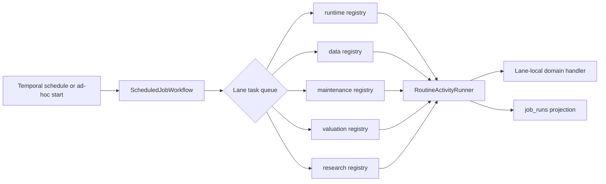

# Workflow Lane Activity Dispatch

Tracker: `spr-g9n`

Status: implemented; routine-lifecycle authority refined by `spr-58o`

This record owns the lane-dispatch decision. The Temporal lifecycle, retry,
identity, and projection contract is defined in
[`2026-07-15_temporal_routine_authority.md`](2026-07-15_temporal_routine_authority.md).
That record supersedes the original single-attempt, application-requeue, and
routine-singleton-lease portions of this design.

## Decision

All routine lanes register the same durable provider activity name,
`run_scheduled_job_activity`, but each worker builds that activity from an
exact lane-local handler registry. A worker cannot import or dispatch handlers
owned by another lane.

| Lane | Required | Representative handlers |
| --- | --- | --- |
| `runtime` | yes | broker sync, strategy entry/manage, alert work, lifecycle starts, outbox publish |
| `data` | yes | ticker sources, calendar refresh |
| `maintenance` | yes | schedule reconciliation, backup, health snapshot, log retention |
| `valuation` | optional | company valuation bootstrap/screen/resolve |
| `research` | optional | TradingAgents scan |

Lifecycle and capture workers are intentionally separate. They do not use the
routine activity registry.

## Ownership

| Component | Responsibility |
| --- | --- |
| `core.jobs.registry` | One authored job-type-to-lane mapping and per-type activity retry limit. |
| `core.jobs.lane_handlers` | Exact handler registry for one lane. |
| `core.workflow_runtime.routine_activity` | Validate the provider request and lane, then adapt it to the shared runner. |
| `core.jobs.execution.RoutineActivityRunner` | Project the current Temporal activity attempt into `job_runs`, invoke the handler, and persist its bounded outcome. |
| Lane handler | Domain work only; return `RoutineOutcome` and emit heartbeats during long work. |

The provider queue is a deployment/capacity boundary. `workflow_lane` is the
durable domain name. Queue strings and provider connection details remain
inside `core.workflow_runtime`.

## Dispatch Flow



## Handler Contract

```python
@dataclass(frozen=True)
class RoutineExecutionContext:
    job_run_id: str
    job_key: str
    job_type: str
    workflow_lane: str
    scheduled_for: datetime
    provider_attempt: int
    worker_name: str
    database_url: str
    storage: StorageContext
    payload: Mapping[str, Any]
    heartbeat: Callable[[], None]

@dataclass(frozen=True)
class RoutineOutcome:
    job_status: Literal["succeeded", "skipped"]
    persisted_result: dict[str, Any]
```

Handlers do not create, claim, requeue, or finalize job rows. They do not
acquire routine singleton leases. Long-running handlers call `heartbeat`; the
runner mirrors that signal into the Postgres projection and Temporal.

## Failure Contract

- Invalid job type, wrong lane, malformed payload, and projection identity
  conflicts are non-retryable application errors.
- Transient handler failures are retried by Temporal according to the job
  registry, never by creating a second application queue attempt.
- Handler side effects must be idempotent for provider at-least-once delivery.
- Alert webhook delivery is the explicit exception: provider retries are
  limited to one because a lost response cannot prove the webhook was not
  delivered. Its domain delivery record owns later delivery attempts.
- Optional lane import failures cannot break required lane startup.

## Stable Provider Compatibility

The workflow type, activity name, and task queues remain stable. The workflow
wire request stays a JSON-compatible dictionary so rollout does not require a
custom payload converter. Provider-specific validation errors use structured
Temporal `ApplicationError` types.

## Validation Gates

- Every registered routine job type has exactly one lane and one handler.
- A worker for one lane exposes no handler from another lane.
- Optional lane dependencies are absent from required worker import graphs.
- Schedule reconciliation resolves every enabled routine to a registered lane.
- Live lane pollers, schedule config hash, recent job projections, and Temporal
  workflow histories agree after rollout.

## Result

`spr-g9n` removed the monolithic cross-lane dispatcher and duplicate lane
metadata. `spr-58o` subsequently removed routine singleton leases, application
requeues, and the second due-slot calculation while preserving this lane-local
dispatch boundary.
