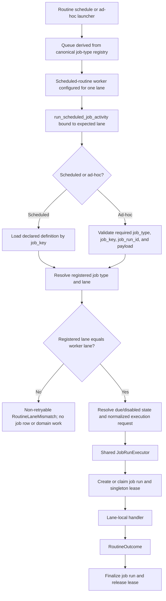

# Workflow-Lane Activity Dispatch

Tracker: `spr-g9n`

Status: implemented and live-validated on 2026-07-15

Authority: implementation record. `docs/current_system_state.md` remains the
canonical description of the live runtime.

## Decision Summary

Keep the durable Temporal activity name `run_scheduled_job_activity`, but build
that activity separately inside each scheduled-routine worker with:

- the worker's expected lane;
- an immutable registry containing only that lane's routine handlers; and
- one shared `JobRunExecutor` that owns job-run and singleton-lease lifecycle.

The activity resolves and validates the request, derives the routine's lane from
the canonical job-type registry, rejects wrong-lane work before persistence or
domain work, and delegates valid work to the shared executor and one lane-local
handler.

Also remove two pieces of misleading or duplicated registry state:

- delete unused per-job `activity_name` metadata; and
- derive each lane's job-type inventory from the canonical job-type-to-lane
  mapping instead of manually maintaining the same relationship in both
  `JOB_SPECS` and `WorkflowLaneSpec.job_types`.

This is the smallest durable cutover: it enforces lane ownership, isolates
optional imports, removes the monolithic dispatcher, and preserves workflow
history and schedule contracts.

## Scope

This proposal applies only to the five scheduled-routine lanes:

| Lane | Owned routine types |
| --- | --- |
| `runtime` | broker sync, alert delivery/reconcile, strategy entry/manage, execution-lifecycle start, engine outbox publish |
| `data` | ticker source, calendar event refresh |
| `maintenance` | routine-schedule reconcile, Postgres backup, ops health snapshot, log retention |
| `valuation` | company valuation bootstrap, screen materialization, unresolved-position resolution |
| `research` | TradingAgents scan |

The following are explicitly out of scope:

- the `lifecycle` lane, which runs trade/close workflows and broker activities;
- the `capture` lane, which runs the long-lived capture-session workflow;
- routine schedule rendering, queue naming, schedule IDs, and the
  `ScheduledJobWorkflow` wire payload;
- domain-service ownership inside strategy, data, maintenance, valuation, or
  research services; and
- retry behavior beyond the `spr-0zp` decision implemented with this cutover:
  routine activities get one provider attempt, while deliberate application
  requeues own `retry_count` and new orchestration identity.

No lifecycle or capture worker should import, build, or validate routine-handler
registries as part of this change.

## Verified Former State

Before this cutover, the scheduled-routine workers for runtime, data,
maintenance, valuation, and research all registered the same Python activity
function. Queue routing normally sent work to the correct worker, but the
activity itself could execute every registered routine type.

`core.activities.jobs` owned all of these concerns in one module:

- scheduled and ad-hoc request resolution;
- job-run creation, requeue, status transitions, and failure recording;
- singleton lease acquisition, renewal, and release;
- Temporal heartbeat emission;
- dispatch across seventeen routine types;
- result compaction; and
- eager imports spanning required and optional lanes.

The cutover removed these concrete weaknesses:

- lane ownership is a queue-routing convention rather than an activity
  invariant;
- `_run_job` grows whenever any lane gains a routine type;
- optional valuation and research dependencies are imported into required
  workers;
- `(result, compact)` is a positional contract whose job status is inferred
  from arbitrary domain result vocabulary;
- `JobSpec.activity_name` advertises per-job activities that do not exist;
- job-type-to-lane ownership is authored twice, allowing registry drift; and
- the activity accepts `payload["db"]` as an infrastructure override even
  though the worker already owns its configured storage target.

The shared lifecycle remained the correct ownership model, but its retry
behavior required a separate explicit decision. `spr-0zp` selected one provider
attempt for this side-effecting routine activity. A failed activity therefore
remains a failed workflow execution instead of a provider retry observing the
terminal job row and succeeding as `job_run_already_terminal`. Deliberate
application requeues retain ownership of `retry_count`.

## Implemented Modules And Ownership

| Component | Responsibility |
| --- | --- |
| `core.jobs.contracts` | Provider-neutral resolved-request, handler-context, handler, and outcome contracts. |
| `core.jobs.execution` | The one job-run create/requeue, lease, heartbeat, finalization, and failure lifecycle. |
| `core.jobs.handlers.runtime` | Runtime-lane handlers and their bounded result projections. |
| `core.jobs.handlers.data` | Data-lane handlers and their bounded result projections. |
| `core.jobs.handlers.maintenance` | Maintenance-lane handlers and their bounded result projections. |
| `core.jobs.handlers.valuation` | Valuation handlers and valuation-only dependencies. |
| `core.jobs.handlers.research` | TradingAgents handler and research-only dependencies. |
| `core.jobs.handlers` | Lane-selective loader and exact-set registry validation; it must not eagerly re-export lane modules. |
| `core.workflow_runtime.routine_activity` | Temporal adapter that validates raw requests, enforces the expected lane, and delegates to `JobRunExecutor`. |
| `core.workflow_runtime.worker` | Selects lifecycle activities or one lane-bound routine activity according to the configured worker lane. |
| `core.jobs.registry` | Canonical job-type-to-lane mapping plus lane operational metadata and a derived lane-to-job-types view. |

`core.activities.broker` remains the lifecycle-workflow activity adapter.
`core.activities.jobs` is displaced fully and must be deleted, not retained as a
wrapper. `core.activities.__init__` must stop exporting the removed routine
activity; the routine worker imports its factory from
`core.workflow_runtime.routine_activity`.

## Canonical Registry Model

`JOB_SPECS` remains the one authored ownership map. Each entry contains only the
job type and workflow lane. `activity_name` is deleted.

`WorkflowLaneSpec` continues to own operational lane metadata:

- required for trading;
- required for deploy;
- optional;
- maximum concurrency.

Its public job-type inventory must be derived from `JOB_SPECS`, either through a
property or `get_job_types_for_lane(lane)`. Existing ops callers may keep
consuming `job_types`, but that value must no longer be separately authored.

At worker startup, the selected handler registry is checked with exact-set
semantics:

```python
expected = frozenset(get_job_types_for_lane(lane))
actual = frozenset(handlers)
if actual != expected:
    raise RoutineHandlerRegistryError(lane=lane, missing=expected - actual, extra=actual - expected)
```

This catches missing, cross-lane, and unregistered handlers before the worker
starts polling. Lifecycle and capture have no routine handler set and must be
rejected by the routine-registry loader rather than treated as empty valid
registries.

## Request Resolution And Execution Flow

The Temporal wire contract remains a dictionary so existing workflow histories
and schedule inputs remain valid. The provider adapter immediately normalizes it
into a provider-neutral `ResolvedRoutineRequest`.



Resolution order is an invariant:

1. Validate the raw request shape.
2. For scheduled work, load the declared definition; for ad-hoc work, require a
   registered job type.
3. Derive the registered lane from `JOB_SPECS`.
4. Compare it with the worker's bound lane.
5. Only after the lane matches, resolve disabled/not-due state and create or
   mutate job-run state.

An unknown scheduled `job_key` is configuration drift, not “not due.” It should
raise a non-retryable `RoutineDefinitionNotFound`. A known disabled definition or
a valid definition outside its due slot remains a successful no-op with no job
row, preserving normal schedule-race behavior.

## Provider-Neutral Contracts

### ResolvedRoutineRequest

The adapter passes one normalized contract to the executor:

```python
@dataclass(frozen=True)
class ResolvedRoutineRequest:
    source: Literal["scheduled", "adhoc"]
    job_run_id: str
    job_key: str
    job_type: str
    workflow_lane: str
    orchestration_id: str
    scheduled_for: datetime
    singleton_scope: str | None
    payload: Mapping[str, Any]
```

The adapter constructs a defensive payload copy. The payload is read-only by
handler contract even though nested vendor/domain values may not be deeply
immutable.

### RoutineExecutionContext

The executor passes handlers only the execution facts and owned dependencies
they need:

```python
@dataclass(frozen=True)
class RoutineExecutionContext:
    job_run_id: str
    job_key: str
    job_type: str
    workflow_lane: str
    scheduled_for: datetime
    worker_name: str
    database_url: str
    storage: StorageContext
    payload: Mapping[str, Any]
    heartbeat: Callable[[], None]
```

Handlers must not create, requeue, finalize, or release job-run state, nor may
they acquire or renew singleton leases directly. Long-running handlers may call
the executor-owned heartbeat callback; that callback updates the job run, renews
the lease, and emits the provider heartbeat as one operation.

`StorageContext` remains the existing repository aggregate. This proposal does
not introduce a dependency-injection framework or lane-specific repository
wrappers. Domain services retain their current ownership.

### RoutineHandler And RoutineOutcome

```python
@dataclass(frozen=True)
class RoutineOutcome:
    job_status: Literal["succeeded", "skipped"]
    persisted_result: dict[str, Any]


RoutineHandler = Callable[[RoutineExecutionContext], RoutineOutcome]
```

`job_status` is explicit because domain results use vocabularies such as `ok`,
`healthy`, `degraded`, and `skipped`; those are not the job-run state machine.
`persisted_result` is the bounded job result and activity response. A handler may
transform a larger domain result locally, but it must not return a duplicate full
payload to the executor.

Named `succeeded(result)` and `skipped(result)` constructors are acceptable.
The executor must not infer job status from `persisted_result["status"]`.

## JobRunExecutor Invariants

`JobRunExecutor` is the sole owner of:

- storage-context lifetime;
- worker identity;
- job-run creation and existing-run handling;
- orchestration ownership checks and requeue behavior;
- singleton lease acquisition, renewal, and release;
- queued-to-running-to-terminal transitions;
- heartbeat composition;
- bounded result persistence;
- failure recording; and
- cleanup in `finally` paths.

The executor receives a resolved request and one already-selected handler. It
must not know concrete routine types or import lane modules.

Lane handlers own:

- payload-to-domain-request adaptation;
- calling the existing domain service;
- deciding whether the domain result means job success or skip; and
- producing the bounded persisted result.

Result-compaction helpers move beside their lane handlers. They do not remain in
the provider adapter or shared executor.

## Infrastructure Configuration Boundary

The worker process owns infrastructure endpoints. A routine payload must not
select a database.

As part of this cutover:

- `database_url` comes from the `StorageContext` created from runtime config;
- handlers must not read `payload["db"]`;
- no compatibility alias for the payload database override is retained; and
- config validation must confirm no declared or generated routine relies on
  that override before deletion.

Other endpoint overrides should remain only where an existing domain contract
deliberately owns them. This proposal does not authorize a broad endpoint-config
rewrite.

## Failure Semantics

| Condition | Required behavior |
| --- | --- |
| Malformed raw request | Non-retryable `RoutineRequestInvalid`; no job row. |
| Unknown scheduled `job_key` | Non-retryable `RoutineDefinitionNotFound`; no job row. |
| Unknown ad-hoc `job_type` | Non-retryable `RoutineTypeNotRegistered`; no job row. |
| Registered lane differs from worker lane | Non-retryable `RoutineLaneMismatch`; no job row or domain work. |
| Handler exact-set mismatch | Worker startup fails before polling. |
| Known definition is disabled or not due | Successful no-op; no job row. |
| Singleton lease unavailable | Persist the current skipped job outcome and return successfully. |
| Handler returns `RoutineOutcome` | Persist its explicit job status and bounded result. |
| Handler raises | Record failure when a job row exists, release the lease, and re-raise. |
| Job run is superseded | Do not finalize another orchestration's row; fail explicitly. |

Provider-specific non-retryable failures should use Temporal's structured
application-error mechanism and include only safe identifiers: job key, job
type, expected lane, registered lane, and orchestration ID. Do not include the
routine payload or credentials in error details.

`spr-0zp` governs automatic retry and activity-attempt behavior. The workflow
sets `RetryPolicy(maximum_attempts=1)`. Handler failure remains failed; a new
attempt requires an explicit application requeue and orchestration identity.

## Temporal Compatibility

The following provider contracts do not change:

- workflow type: `ScheduledJobWorkflow`;
- activity name: `run_scheduled_job_activity`;
- workflow request dictionary shape;
- provider task-queue names;
- routine schedule IDs and inputs; and
- scheduled/ad-hoc launcher queue selection through the job-type registry.

The same activity name can be registered independently on different task queues.
The worker's lane-bound closure changes Python registration and enforcement, not
the durable provider command recorded in workflow history.

No workflow version bridge, compatibility activity, schedule pause, or schedule
reconciliation is required for this refactor. A routine-schedule dry run is a
verification gate; it should report no provider contract changes.

## Implemented Cutover Sequence

1. Resolve `spr-0zp` with the single-attempt provider policy.
2. Remove duplicated lane inventory from the registry and expose the derived
   job-types-by-lane view while preserving current ops callers.
3. Add provider-neutral contracts and extract `JobRunExecutor` without changing
   concrete dispatch.
4. Move handlers and result projections into lane-local modules. Keep
   `core.jobs.handlers.__init__` free of eager lane imports.
5. Add exact-set handler validation and the lane-bound activity factory.
6. Update `workflow_runtime.worker` so lifecycle registration remains separate
   and scheduled-routine lanes each register only their bound activity.
7. Remove `core.activities.jobs`, its export, `_run_job`, and unused
   `activity_name` metadata in the same implementation change.
8. Validate all five scheduled-routine registries without starting optional
   pollers.
9. Restart `workflow-data`, then `workflow-maintenance`, then both
   `workflow-runtime` replicas, verifying each required lane before continuing.
10. Leave `workflow-lifecycle` and `capture-worker` untouched. Do not enable
    valuation or research in the live plane solely to validate imports.

The stable wire contract makes mixed old/new workers queue-compatible during the
brief runtime rolling restart. Final code must still contain only the new path;
mixed deployment is a rollout condition, not a compatibility layer.

## Validation Evidence

Repository and configuration checks completed:

- required Ruff checks for touched Python;
- `uv run spreads config validate --json`;
- routine-schedule dry run with unchanged schedule IDs, queues, and count;
- exact registry equality for runtime, data, maintenance, valuation, and
  research;
- an import-isolation check proving required lanes do not import valuation or
  TradingAgents modules; and
- a repository search proving `activity_name`, `get_activity_name_for_job_type`,
  `_run_job`, `core.activities.jobs`, and payload database routing are gone.

Live checks completed:

- worker startup and poller health for required lanes;
- a natural or explicitly launched runtime-lane routine;
- a data-lane ticker-source routine;
- a maintenance-lane health snapshot or schedule reconciliation;
- one ad-hoc workflow through the same lane-bound activity path, using an
  existing safe/idempotent maintenance operation rather than a fabricated alert
  or execution intent;
- a deliberate wrong-lane workflow with a unique provider workflow ID,
  non-retryable `RoutineLaneMismatch`, no job row, and no domain side effect;
- `spreads runtime verify`, `spreads jobs`, and `spreads ops state` showing
  healthy required lanes and no new actionable failed routine; and
- recent required-lane logs free of registry, import, activity-registration, or
  lease-finalization errors.

Optional-lane validation is import and exact-set registration validation by
default. Live valuation or research execution requires a separate intentional
operator decision because those lanes are disabled by deployment policy.

The final live cutover review at `2026-07-15T17:12:34Z` included:

- healthy runtime, data, and maintenance pollers after staged restarts;
- natural successful broker-sync and ticker-source runs;
- a healthy scheduled maintenance snapshot;
- successful ad-hoc maintenance reconciliation
  `routine_schedule_reconcile:adhoc-smoke:20260715T170946Z` with
  `retry_count=0`;
- failed wrong-lane workflow `wrong-lane-smoke:20260715T171010Z` with
  `RoutineLaneMismatch`, no job row, and Temporal history showing
  `maximum_attempts=1`;
- 29 healthy routine schedules with a matching config hash; and
- zero blocked lanes, due routines, stale runs, or actionable failures.

## Risks And Mitigations

| Risk | Mitigation |
| --- | --- |
| Handler registry diverges from job ownership. | Derive expected ownership from one registry and fail startup on exact-set mismatch. |
| Required workers import optional dependencies. | Lane-selective imports; no eager re-exports from the handlers package. |
| Lifecycle extraction changes retry behavior accidentally. | Resolve or fold in `spr-0zp`; characterize the approved behavior before live rollout. |
| Provider history cannot find the moved activity. | Preserve the exact durable activity name and request shape. |
| Refactor duplicates job-run lifecycle branches. | One `JobRunExecutor`; handlers never mutate job or lease state directly. |
| Wrong-lane smoke pollutes job health. | Reject before persistence and use a unique provider workflow ID. |
| Result payload growth leaks into jobs state. | Require a single bounded `persisted_result` from every handler. |
| Payload redirects work to another database. | Remove payload database routing and use worker-owned runtime config. |
| Optional-lane validation causes live side effects. | Validate imports/registries without enabling their pollers. |

## Rejected Alternatives

### Per-job provider activities

One activity per job type would create seventeen durable provider contracts,
force workflows to derive activity names from mutable registry metadata, and
increase migration and observability surface without strengthening ownership
beyond a lane-local registry.

Decision: reject.

### One durable provider activity name per lane

This would make provider diagnostics slightly more explicit, but it changes
workflow commands and recorded activity names. Safe rollout would require a
versioned workflow or compatibility registration.

Decision: reject unless provider-level lane activity metrics become a concrete
requirement.

### One global dispatcher with a lane check

This closes the immediate wrong-lane hole but retains cross-lane imports,
duplicated ownership metadata, and the growing conditional dispatcher.

Decision: reject as an incomplete cleanup.

### A new `core.routines` package

The repo already assigns scheduling and worker entrypoints to `core.jobs`.
Creating a parallel package would split ownership without adding a real domain
boundary.

Decision: reject; keep the implementation under `core.jobs`.

## Implemented Decision

`spr-g9n` implemented all of the following as one clean cutover:

1. stable Temporal workflow/activity/queue contracts;
2. lane-bound routine activity registration;
3. one shared `JobRunExecutor`;
4. one authored job-type-to-lane registry with derived reverse views;
5. lane-local handlers and optional-import isolation;
6. explicit handler outcomes and bounded persisted results;
7. deletion of the monolithic activity dispatcher and stale activity metadata;
8. removal of payload-level database routing; and
9. the `spr-0zp` single-attempt provider contract rather than an accidental
   retry-policy change.

`spr-0zp` was implemented and closed before `spr-g9n` close-out.
