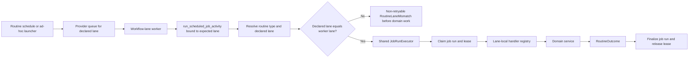

# Workflow-Lane Activity Dispatch

Tracker: `spr-g9n`

Status: proposed for review; not implemented

## Recommendation

Keep the stable provider activity contract `run_scheduled_job_activity`, but bind
each worker process to a lane-specific job-run executor and routine-handler registry.
The activity must resolve the requested routine, validate that its registered
lane equals the worker's expected lane, and only then create or claim job-run
state.

This gives Spreads hard lane ownership without changing workflow history,
schedule inputs, or provider activity names. It also removes the current
monolithic `_run_job` dispatcher and isolates optional dependencies by lane.

## Context

Today every non-lifecycle worker registers the same Python activity function.
Queue routing normally sends work to the right lane, but the activity itself can
execute every registered routine type. The same module imports runtime, data,
research, and valuation services and owns both job-run lifecycle state and all
domain dispatch.

The weaknesses are:

- lane ownership is a routing convention rather than an enforced activity
  invariant;
- `_run_job` grows whenever any lane gains a routine type;
- optional-lane dependencies are imported into required workers;
- the positional `(result, compact)` return contract is easy to misuse;
- `JobSpec.activity_name` advertises per-job activities that do not exist.

The job-run lifecycle itself is sound and should stay singular: resolve,
claim/requeue, acquire lease, mark running, heartbeat, run domain work, finalize,
release lease.

## Target Containers And Modules

| Component | Responsibility |
| --- | --- |
| `core.jobs.contracts` | Provider-neutral `RoutineExecutionContext` and `RoutineOutcome` contracts. |
| `core.jobs.execution` | The one job-run claim, lease, heartbeat, finalization, and failure lifecycle. |
| `core.jobs.handlers.runtime` | Broker sync, strategy entry/manage, alerts, lifecycle starts, and outbox publishing. |
| `core.jobs.handlers.data` | Ticker sources and calendar refresh. |
| `core.jobs.handlers.maintenance` | Schedule reconciliation, backup, health snapshot, and log retention. |
| `core.jobs.handlers.valuation` | Company-valuation routines and their optional dependencies. |
| `core.jobs.handlers.research` | TradingAgents routines and their optional dependencies. |
| `core.workflow_runtime.routine_activity` | Builds the provider activity entrypoint bound to one expected workflow lane. |
| `core.workflow_runtime.worker` | Registers the lane-bound activity and the existing short-lived scheduled-job workflow. |
| `core.jobs.registry` | Owns routine-type-to-lane metadata; remove the unused `activity_name` field. |

`core.activities.broker` remains the lifecycle-workflow activity adapter. The
current `core.activities.jobs` module is displaced fully; it should not remain
as a wrapper or second dispatch path.

## Execution Flow



## Interfaces

### RoutineExecutionContext

An immutable provider-neutral context passed to handlers:

```python
@dataclass(frozen=True)
class RoutineExecutionContext:
    job_run_id: str
    job_key: str
    job_type: str
    workflow_lane: str
    worker_name: str
    database_url: str
    storage: StorageContext
    payload: Mapping[str, Any]
    heartbeat: Callable[[], None]
```

Handlers must not create, requeue, finalize, or release job-run state, nor may
they renew leases directly. They may invoke the executor-owned `heartbeat`
callback so long-running domain work keeps the run and lease alive.

### RoutineOutcome

Replace the positional result tuple with a named contract:

```python
@dataclass(frozen=True)
class RoutineOutcome:
    job_status: Literal["succeeded", "skipped"]
    persisted_result: dict[str, Any]
```

`job_status` is explicit because a domain result's own `status` vocabulary
(`ok`, `healthy`, `degraded`, or `skipped`) is not the job-run state machine.
`persisted_result` is the bounded durable/operator payload and the activity
response. A handler may transform a larger domain result locally, but should not
retain or return that duplicate payload. Convenience constructors may build
succeeded or skipped outcomes, but the executor must not infer job status from
an arbitrary result mapping.

### Lane Handler Registry

Each lane module exports an immutable mapping from its owned job types to
handler callables. `build_lane_handlers(lane)` imports only the selected lane
module and verifies at worker startup that:

1. every `WorkflowLaneSpec.job_types` entry has exactly one handler;
2. no handler belongs to another lane;
3. no unregistered handler is present.

This startup invariant makes registry drift fail before the worker polls.

### Lane-Bound Provider Activity

`build_routine_activity(expected_lane)` returns a provider-decorated callable
with the existing durable name `run_scheduled_job_activity`. Each worker process
constructs one such callable for its configured lane. Reusing the provider name
is intentional: task queues isolate registrations, while preserving existing
workflow history and avoiding a compatibility bridge.

The activity resolves the scheduled definition or ad-hoc request, compares the
registered lane to `expected_lane`, and raises a non-retryable structured
`RoutineLaneMismatch` before job-row creation or domain work when they differ.

## Ownership Invariants

- Schedule and ad-hoc launchers continue to choose queues from
  `JobSpec.workflow_lane`; callers never choose raw provider queues.
- The worker's configured lane is authoritative for what can execute in that
  process.
- `JobRunExecutor` is the sole job-run/lease lifecycle owner.
- Lane handler modules call domain services; they do not orchestrate workflow
  or job state.
- Optional valuation and research imports occur only in their lane handler
  modules.
- Wrong-lane work is non-retryable configuration failure, not a skip and not a
  domain-service failure.
- No compatibility activity, duplicate dispatcher, or second job-run lifecycle
  remains after cutover.

## Alternatives Considered

### Per-job provider activities

The existing `JobSpec.activity_name` hints at one provider activity per job
type. This provides granular registration, but creates seventeen provider
contracts, forces the workflow to derive activity names from mutable registry
metadata, and requires a workflow-history-aware migration. It adds provider
surface without improving domain ownership beyond a lane-bound registry.

Decision: reject.

### One distinct provider activity name per lane

This makes provider diagnostics explicit, but changes workflow commands and
schedule/ad-hoc request contracts. Safe rollout would require a pause-and-drain
cutover or temporary compatibility activity.

Decision: reject unless provider-level lane activity metrics become a concrete
need.

### Keep one global dispatcher and add a lane check

This closes the immediate wrong-lane hole but retains cross-lane imports and the
growing conditional dispatcher.

Decision: reject as an incomplete cleanup.

## Cutover Plan

1. Add provider-neutral contracts, `JobRunExecutor`, and lane-local handler
   registries.
2. Add startup registry validation and the lane-bound activity factory.
3. Change `workflow_runtime.worker` to construct the activity for its lane.
4. Remove `core.activities.jobs`, `_run_job`, result-compaction helpers from the
   provider adapter, and unused `JobSpec.activity_name` metadata.
5. Restart runtime, data, and maintenance lanes; enable optional lanes only for
   their explicit smoke checks.
6. Prove scheduled and ad-hoc execution on runtime, data, and maintenance lanes.
7. Intentionally submit a wrong-lane request and verify a non-retryable
   `RoutineLaneMismatch` with no domain side effect or queued job row.

The stable activity name and workflow input mean no schedule pause, workflow
version bridge, or compatibility registration is required.

## Validation Gates

- required Ruff checks for touched Python;
- config validation and routine-schedule dry run;
- worker startup invariant for every lane, including disabled optional lanes;
- live runtime-lane broker-sync or alert-reconcile run;
- live data-lane ticker-source run;
- live maintenance reconciliation or health-snapshot run;
- ad-hoc valuation start with the valuation lane intentionally enabled for the
  smoke, then disabled again;
- wrong-lane negative smoke with provider history and absence of domain side
  effects;
- `spreads runtime verify`, `spreads jobs`, and `spreads ops state` show healthy
  required lanes and no actionable failed routine.

## Risks And Mitigations

| Risk | Mitigation |
| --- | --- |
| Handler registry diverges from lane metadata. | Fail worker startup on exact-set mismatch. |
| A lane module imports optional dependencies eagerly. | Import only the selected lane module from `build_lane_handlers`. |
| Refactor duplicates job-run lifecycle branches. | Move lifecycle first, then make every activity adapter delegate to the one executor. |
| Wrong-lane negative smoke pollutes live job health. | Reject before job-row creation and use a unique provider workflow ID. |
| Long handler loses its lease. | Preserve the current heartbeat callback and lease-renewal semantics unchanged. |
| Result payload growth leaks into jobs state. | Require every handler to return a bounded `persisted_result`. |

## Review Decision

Approval means implementing the lane-bound stable-activity design above and
deleting the monolithic dispatcher in one cutover. The main rejected alternative
is per-job provider activities; it is more granular but materially increases
provider contracts and migration risk without a corresponding safety gain.
